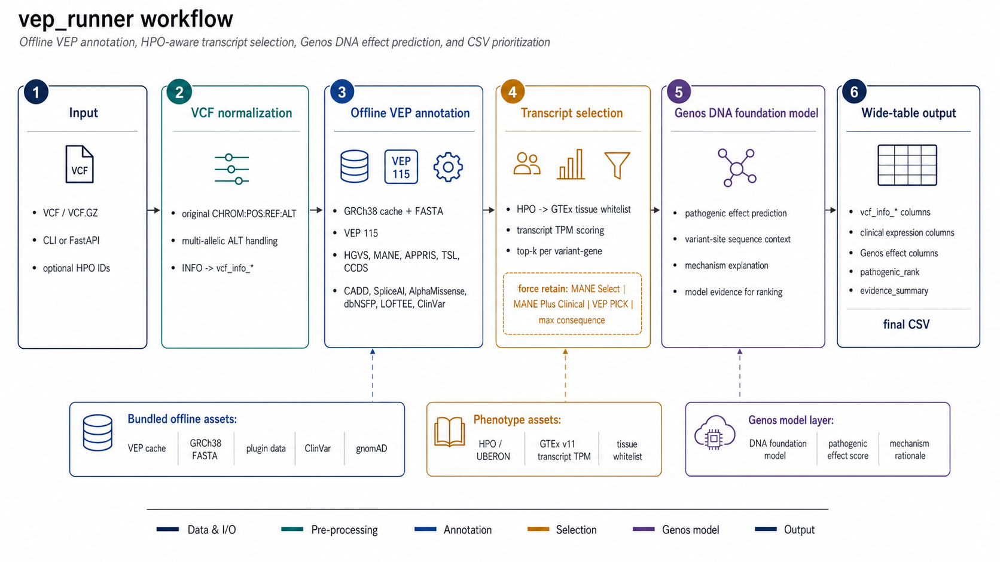

# 自包含 VEP runner

[English version](README.md)

这个仓库只跟踪 VEP runner 的源码、配置、说明文档和小示例。要真正离线跑通
完整注释流程，还需要在仓库根目录下恢复或提供下面列出的运行环境和生物医学
数据目录；这些大文件不会提交到 Git。

当前 bundle 版本：`1.0.0`。

## Git 中不包含的运行资源

要跑通完整离线注释流程，需要在仓库根目录下准备这些本地资源：

- `envs/vep`：`bin/vep` 使用的 VEP/Perl 运行环境
- `envs/gtex_query`：包含 pandas、numpy、duckdb 以及 API/helper 依赖的 Python 环境
- `vep_cache/`：Ensembl VEP GRCh38 cache 和插件代码，包括 LOFTEE
- `vep_data/reference/`：`--hgvs` 使用的 GRCh38 FASTA 和 `.fai`
- `vep_data/ClinVar/`：ClinVar VCF 和 tabix index
- `vep_data/dbNSFP/`、`vep_data/CADD/`、`vep_data/SpliceAI/`、`vep_data/AlphaMissense/`：插件/custom annotation 数据
- `vep_data/GTEx/` 和 `vep_data/hpo_tpm/`：transcript TPM 与 HPO-to-tissue mapping 数据
- `vep_data/regulatory/`：`--regulatory-annotation` 使用的 ENCODE SCREEN cCRE BED
- `vep_data/pseudogene/`：`--pseudogene-annotation` 使用的 GENCODE、Pseudogene.org 和 HGNC 文件

运行产生的 job 状态、缓存、日志、临时文件、上传输入和结果 CSV 也会被
`.gitignore` 排除。

## 目录结构

- `bin/vep`：固定从本目录启动的 VEP launcher
- `bin/run_vep_to_csv.py`：主 wrapper，输入 VCF 或其他 VEP 支持格式，输出 CSV
- `bin/annotate_regulatory.py`：内置 ENCODE SCREEN cCRE VCF INFO 注释器
- `bin/annotate_pseudogene.py`：内置 HGNC-backed pseudogene overlap 注释器
- `bin/export_hpo_tissue_tpm.py`：独立 HPO 到 GTEx/HPA 表达证据导出工具
- `api/main.py`：围绕 wrapper 的 FastAPI 任务队列服务
- `config/vep_runner_config.json`：wrapper 配置，使用 `__VEP_RUNNER__` 占位符
- `envs/vep`：VEP conda 环境
- `envs/gtex_query`：包含 pandas/numpy/duckdb 的 Python 环境，用于 HPO 和 GTEx 查询
- `vep_cache`：VEP offline cache 和插件 `.pm` 文件
- `vep_data`：CADD、SpliceAI、AlphaMissense、dbNSFP、ClinVar、GTEx transcript TPM、HPO mapping、regulatory cCRE、pseudogene 和 reference FASTA 数据
- `examples/example.vcf`：BRAF 示例输入
- `output/`：示例输出目录
- `logs/`：示例日志目录

wrapper 会从自身路径解析所有 bundle 内部路径，所以复制整个 `vep_runner`
目录后，可以在任意工作目录调用。

## 工作流



整体流程：

1. 可选 VCF 前处理：添加内置 regulatory cCRE INFO 字段。
2. 使用本地 cache、插件和 custom data 离线运行 VEP。
3. wrapper 恢复原始 VCF allele/INFO 列，规范化 VEP/plugin 字段，补充 GTEx transcript expression，执行 transcript 选择，并做候选变异排序。
4. 可选 CSV 后处理：追加 pseudogene overlap 列。

## 基本用法

```bash
python3 /path/to/vep_runner/bin/run_vep_to_csv.py \
  -i input.vcf \
  -o output.csv \
  --hgvs \
  --log /path/to/vep_runner/logs/run.log
```

默认输入格式是 VCF。其他 VEP 支持格式可用 `--format` 指定。

默认不会启用内置 ENCODE SCREEN cCRE regulatory 前置注释；需要时使用
`--regulatory-annotation`。默认也不会追加 pseudogene overlap 注释列；需要时
使用 `--pseudogene-annotation`。

默认输出不是 VEP 原始全量 consequence。wrapper 会先保留所有 VEP
transcript consequence，补充 transcript 质量字段，再按每个 variant-gene
选择 transcript，最后只对选中的行做全局排序。默认每个 variant-gene 保留
最多 `--top-k-transcripts 5` 条 primary transcript，并可强制保留 MANE、
VEP PICK 和最高影响 transcript。

如需输出全部 transcript-level consequence：

```bash
python3 /path/to/vep_runner/bin/run_vep_to_csv.py \
  -i input.vcf \
  -o output.all_transcripts.csv \
  --no-transcript-selection
```

## HPO 和表型相关 transcript 选择

wrapper 可以直接接收 HPO ID，并把 HPO 映射成 GTEx tissue 白名单，再参与
transcript expression scoring：

```bash
envs/gtex_query/bin/python bin/run_vep_to_csv.py \
  -i input.vcf \
  -o output.selected_transcripts.csv \
  --hgvs \
  --hpo-id HP:0001250 \
  --hpo-id HP:0004322
```

多个 HPO ID 也可以用逗号写在一起。`--top-n-hpo-tissues` 控制保留多少个
coarse HPO-derived tissue group，然后再展开成 GTEx tissue 名称：

```bash
envs/gtex_query/bin/python bin/run_vep_to_csv.py \
  -i input.vcf \
  -o output.hpo.csv \
  --hgvs \
  --hpo-id HP:0001250,HP:0000825,HP:0008066 \
  --top-n-hpo-tissues 3
```

## 大文件模式

大 VCF 默认使用 disk-backed SQLite conversion，避免 raw VEP rows 和全局
pathogenic ranking 全部堆在 Python 内存里。旧版 in-memory converter 仍可用
`--conversion-mode memory` 做对照。VEP fork 数建议保守设置：

```bash
envs/gtex_query/bin/python bin/run_vep_to_csv.py \
  -i large.vcf.gz \
  -o large.vep.csv \
  --hgvs \
  --fork 8
```

SQLite backend 会在输出 CSV 旁边创建临时 staging database。只有需要检查或复用
staging 文件时，才需要显式指定：

```bash
--sqlite-db /path/to/staging.sqlite --keep-sqlite-db
```

## CLI 参数速查

常用 wrapper 参数：

- `--hgvs`：使用内置 GRCh38 FASTA 添加 HGVS cDNA/protein 注释
- `--fork N`：传给 VEP 的 fork 数，默认 `1`
- `--format FORMAT`：VEP 输入格式，默认 `vcf`
- `--keep-vep PATH`：保留 raw VEP tab 输出
- `--log PATH`：写入 VEP 命令和 stdout/stderr 日志
- `--disable-plugin NAME`：禁用一个插件或 custom annotation，可选 `cadd`、`spliceai`、`alphamissense`、`dbnsfp`、`loftee`、`clinvar`；可重复使用
- `--dry-run`：只打印 VEP 命令，不实际运行

Transcript 和表达相关参数：

- `--top-k-transcripts N`：每个 variant-gene 选择的 primary transcript 数，默认 `5`
- `--no-transcript-selection`：输出全部 transcript-level consequence
- `--clinical-tissue NAME`：表型相关 GTEx tissue 白名单，可重复或逗号分隔
- `--clinical-tissues-file PATH`：从文件读取 GTEx tissue 名称
- `--hpo-id HP:...`：把 HPO ID 映射到 GTEx tissue，可重复或逗号分隔
- `--hpo-file PATH`：从文件读取 HPO ID
- `--top-n-hpo-tissues N`：HPO 映射时保留的 coarse tissue group 数，默认 `3`
- `--disable-gtex-expression`：跳过 GTEx transcript expression 查询

可选内置前处理/后处理：

- `--regulatory-annotation`：VEP 前给 VCF 添加 ENCODE SCREEN cCRE INFO 字段
- `--regulatory-log-json PATH`：写 regulatory annotation JSON 统计
- `--regulatory-summary-tsv PATH`：写 regulatory annotation TSV 统计
- `--pseudogene-annotation`：CSV 转换后追加 pseudogene overlap 列
- `--pseudogene-log-json PATH`：写 pseudogene annotation JSON 统计

## CSV 输出列

CSV 输出下面这些核心列。缺失值统一写成 `-`，不会写空字符串。
如果输入格式是 VCF，wrapper 还会从原始 VCF header 读取 `##INFO`
定义，并把每个 INFO 字段作为动态列插入到 `alt` 后面，列名格式为
`vcf_info_<INFO_ID>`，例如 `vcf_info_AC`、`vcf_info_AF`、`vcf_info_DP`。
如果启用 `--regulatory-annotation`，regulatory 前置注释会生成
`vcf_info_REG_CCRE_ID`、`vcf_info_REG_CCRE_CLASS`、
`vcf_info_REG_CCRE_COUNT` 和 `vcf_info_REG_CCRE_SOURCE`。
默认配置使用 Ensembl transcript ID，并通过 `--xref_refseq` 保留对应
RefSeq `NM_`/`NR_`。默认不使用 VEP `--pick` 截断输出；VEP `PICK=1`
只作为 `vep_pick` 字段参与轻量 tie-break 和强制保留。

```text
chrom,pos,ref,alt,[vcf_info_*],gene_symbol,all_genes,transcript_id,refseq_id,biotype,canonical,mane,mane_select,mane_plus_clinical,appris,tsl,ccds,vep_pick,transcript_flags,consequence,impact,hgvsc,hgvsp,cdna_position,cds_position,protein_position,amino_acids,codons,exon,intron,strand,protein_domains,revel_score,cadd_phred,gnomAD_popmax_AF,gnomAD_eas_AF,gnomAD_nhomalt,spliceAI_ds_max,spliceAI_type,loftee_lof_flag,loftee_lof_filter,clinvar_significance,clinvar_review_status,clinvar_star_rating,clinical_gtex_tissue_whitelist,clinical_best_tissue,clinical_transcript_tpm,gtex_transcript_max_tissue,gtex_transcript_max_tpm,gtex_transcript_top5_tissues,gtex_max_tissue_in_clinical_whitelist,clinical_vs_global_tpm_ratio,gtex_lookup_status,tx_consequence_score,tx_confidence_score,clinical_expression_score,tx_tie_breaker_score,tx_selection_score,tx_rank_within_variant,tx_eligibility,tx_exclusion_reason,tx_rescue_reason,tx_selected_reason,pathogenic_rank,evidence_summary
```

启用 `--pseudogene-annotation` 后，最终 CSV 还会包含
`is_pseudogene`、`pseudogene_name` 和 `pseudogene_source`。

### 字段来源和含义

| 字段 | 含义 | 来源和生成方式 |
| --- | --- | --- |
| `chrom` | 染色体/contig 名称。 | 优先来自原始输入 VCF 的 `CHROM` 列。wrapper 会读取原始 VCF 坐标，避免 VEP 对 indel 做坐标规范化后丢失原始坐标。找不到原始映射时，从 VEP `Uploaded_variation` 解析。 |
| `pos` | 1-based 变异位置。 | 优先来自原始输入 VCF 的 `POS` 列；找不到时从 VEP `Uploaded_variation` 解析。 |
| `ref` | 参考等位基因。 | 优先来自原始输入 VCF 的 `REF` 列；找不到时从 VEP `Uploaded_variation` 解析。 |
| `alt` | 替代等位基因。 | 优先来自原始输入 VCF 的 `ALT` 列。多等位基因 VCF 会按每个 ALT 等位基因建立原始坐标映射；找不到时从 VEP `Uploaded_variation` 解析。 |
| `vcf_info_*` | 原始 VCF `INFO` 字段。 | 仅 VCF 输入时输出。wrapper 根据 `##INFO=<ID=...>` 动态生成列，位置在 `alt` 后面。`Number=A` 字段会按当前 ALT 等位基因取对应值，`Number=R` 字段会取当前 ALT 对应的非 REF 值，其他字段原样输出；flag 字段写为 `1`。 |
| `vcf_info_REG_CCRE_ID` | 命中的 ENCODE SCREEN cCRE ID。 | 来自 VEP 前置的 bundled regulatory 注释。多个 cCRE ID 用逗号分隔，未命中为 `-`。 |
| `vcf_info_REG_CCRE_CLASS` | 命中的 cCRE 类型。 | 来自 ENCODE SCREEN cCRE overlap，例如 `PLS`、`pELS`、`dELS`、`CA-CTCF`、`CA-TF`、`TF`。 |
| `vcf_info_REG_CCRE_COUNT` | 当前变异区间重叠到的 cCRE 区间数。 | 由 `bin/annotate_regulatory.py` 按 VCF `POS` 和 `REF` 长度计算区间后与 bundled BED overlap 得到。 |
| `vcf_info_REG_CCRE_SOURCE` | regulatory 注释来源标签。 | 默认 `ENCODE_SCREEN_v4_GRCh38`。 |
| `gene_symbol` | 当前输出行对应的基因符号。 | 依次取 VEP `SYMBOL`、`Extra.SYMBOL`、`Gene` 的第一个非空值。 |
| `all_genes` | 同一个 `Uploaded_variation` 在本次 VEP 输出中命中的所有基因符号。 | wrapper 汇总同一变异 ID 下所有非空 `gene_symbol`，排序后用逗号连接。没有可汇总基因时退回当前行 `gene_symbol`。 |
| `transcript_id` | 当前 consequence 使用的转录本 ID。 | 来自 VEP `Feature`。当前默认使用 Ensembl transcript ID，例如 `ENST...`，并保留版本号。 |
| `refseq_id` | VEP 交叉引用到的 RefSeq transcript ID。 | 来自 `--xref_refseq` 生成的 `RefSeq` 字段，可能包含多个 `NM_`/`NR_`/`XM_`/`XR_` ID，用逗号分隔。 |
| `biotype` | transcript biotype。 | 来自 VEP `BIOTYPE`，例如 `protein_coding`、`processed_transcript`、`nonsense_mediated_decay`。部分 biotype 会影响 `tx_eligibility`。 |
| `canonical` | 是否为 VEP canonical transcript。 | 来自 VEP `CANONICAL`，通常为 `YES` 或 `-`。 |
| `mane` | MANE 标记。 | 来自 VEP `MANE`，常见值包括 `MANE_Select`、`MANE_Plus_Clinical`。 |
| `mane_select` | MANE Select RefSeq ID。 | 来自 VEP `MANE_SELECT`。非空时该 transcript 会获得较高 `tx_confidence_score`，并可能被强制保留。 |
| `mane_plus_clinical` | MANE Plus Clinical RefSeq ID。 | 来自 VEP `MANE_PLUS_CLINICAL`。非空时该 transcript 会获得较高 `tx_confidence_score`，并可能被强制保留。 |
| `appris` | APPRIS principal/alternative 标记。 | 来自 VEP `APPRIS`，例如 `P1`、`P4`、`A1`。principal transcript 在 `tx_confidence_score` 中加分更多。 |
| `tsl` | Transcript Support Level。 | 来自 VEP `TSL`。`1`、`2`、`3` 会在 `tx_confidence_score` 中加分；无其他支持的 `TSL=5` transcript 可能被排除。 |
| `ccds` | CCDS ID。 | 来自 VEP `CCDS`。非空时提高 transcript 置信度。 |
| `vep_pick` | VEP `PICK` 标记。 | 来自 VEP `--flag_pick`。wrapper 默认不使用 VEP `--pick` 截断输出，只把 `PICK=1` 作为 tie-break 和强制保留依据。 |
| `transcript_flags` | VEP transcript flags。 | 来自 VEP `FLAGS`。`cds_start_NF`、`cds_end_NF` 等不完整 CDS 标记会影响 `tx_exclusion_reason`。 |
| `consequence` | VEP consequence 术语。 | 来自 VEP `Consequence`，例如 `missense_variant`、`splice_donor_variant`、`intron_variant`。 |
| `impact` | VEP consequence 影响等级。 | 来自 VEP `IMPACT` 或 `Extra.IMPACT`，取值通常为 `HIGH`、`MODERATE`、`LOW`、`MODIFIER`。 |
| `hgvsc` | cDNA 层面的 HGVS 改变。 | 来自 VEP `HGVSc` 或 `Extra.HGVSc`。wrapper 会 URL decode，并去掉转录本前缀，只保留冒号后的部分，例如 `NM_004333.6:c.1799T>A` 输出为 `c.1799T>A`。需要 `--hgvs` 和配置中的 FASTA。 |
| `hgvsp` | 蛋白层面的 HGVS 改变。 | 来自 VEP `HGVSp` 或 `Extra.HGVSp`。wrapper 会 URL decode，并去掉蛋白/转录本前缀，只保留冒号后的部分，例如输出 `p.Val600Glu`。同义突变会显示 `p.Ser290=`，不是 URL 编码的 `%3D`。 |
| `cdna_position` | cDNA 位置。 | 来自 VEP `cDNA_position`。 |
| `cds_position` | CDS 编码区位置。 | 来自 VEP `CDS_position`。 |
| `protein_position` | 蛋白氨基酸位置。 | 来自 VEP `Protein_position`。 |
| `amino_acids` | 氨基酸变化。 | 来自 VEP `Amino_acids`，例如 `R/C`、`V/E`。 |
| `codons` | 密码子变化。 | 来自 VEP `Codons`，例如 `Cgt/Tgt`。 |
| `exon` | 外显子编号。 | 来自 VEP `EXON` 或 `Extra.EXON`，常见格式为 `6/27`。 |
| `intron` | 内含子编号。 | 来自 VEP `INTRON` 或 `Extra.INTRON`，常见格式为 `2/15`。 |
| `strand` | 转录本链方向。 | 来自 VEP `STRAND` 或 `Extra.STRAND`。`1` 表示正链，`-1` 表示负链。 |
| `protein_domains` | 蛋白结构域注释。 | 来自 VEP `DOMAINS` 或 `Extra.DOMAINS`，由 VEP `--domains` 产生。 |
| `revel_score` | REVEL missense pathogenicity score。 | 来自 dbNSFP 插件字段 `REVEL_score`。没有 dbNSFP 命中或该变异不适用时为 `-`。 |
| `cadd_phred` | CADD PHRED score。 | 依次取 dbNSFP 风格字段 `CADD_phred`、`Extra.CADD_phred`、CADD 插件风格字段 `CADD_PHRED`、`Extra.CADD_PHRED` 的第一个非空值。 |
| `gnomAD_popmax_AF` | gnomAD population maximum allele frequency。 | 优先来自 dbNSFP `gnomAD4.1_joint_POPMAX_AF`。如果缺失，wrapper 从 VEP cache 的 gnomAD exome/genome population AF 字段中取最大值；如果 population AF 都缺失，再退回 `max(gnomADe_AF, gnomADg_AF)`。 |
| `gnomAD_eas_AF` | gnomAD East Asian allele frequency。 | 优先来自 dbNSFP `gnomAD4.1_joint_EAS_AF`。如果缺失，退回 VEP cache 字段 `max(gnomADe_EAS_AF, gnomADg_EAS_AF)`。 |
| `gnomAD_nhomalt` | gnomAD homozygous alternate count。 | 来自 dbNSFP `gnomAD4.1_joint_nhomalt` 或 `Extra.gnomAD4.1_joint_nhomalt`。VEP cache 的 gnomAD AF 不提供 homozygote alternate count，所以没有 dbNSFP 命中时通常为 `-`。 |
| `spliceAI_ds_max` | SpliceAI 四类 delta score 的最大值。 | 来自 SpliceAI 插件 `SpliceAI_pred`。wrapper 解析 `DS_AG`、`DS_AL`、`DS_DG`、`DS_DL`，取最大分数。 |
| `spliceAI_type` | `spliceAI_ds_max` 对应的剪接影响类型。 | 由 SpliceAI 最大分数对应的字段决定：`DS_AG` -> `acceptor_gain`，`DS_AL` -> `acceptor_loss`，`DS_DG` -> `donor_gain`，`DS_DL` -> `donor_loss`。如果最大分数不存在或 <= 0，则为 `-`。 |
| `loftee_lof_flag` | LOFTEE LoF 判断。 | 来自 LOFTEE 插件 `LoF` 或 `Extra.LoF`，常见值包括 `HC`、`LC`。 |
| `loftee_lof_filter` | LOFTEE 过滤原因。 | 来自 LOFTEE 插件 `LoF_filter` 或 `Extra.LoF_filter`。非空通常表示该 LoF 判断被某些规则过滤或降级。 |
| `clinvar_significance` | ClinVar 临床意义。 | 来自自定义 ClinVar VCF 注释字段 `ClinVar_CLNSIG` 或 `Extra.ClinVar_CLNSIG`，下划线会转为空格。缺失为 `-`。 |
| `clinvar_review_status` | ClinVar review status。 | 来自自定义 ClinVar VCF 注释字段 `ClinVar_CLNREVSTAT` 或 `Extra.ClinVar_CLNREVSTAT`，下划线会转为空格。缺失为 `-`。 |
| `clinvar_star_rating` | ClinVar 证据星级，0-4。 | wrapper 根据原始 `CLNREVSTAT` 计算：`practice_guideline` -> 4；`reviewed_by_expert_panel` -> 3；`criteria_provided,_multiple_submitters,_no_conflicts` -> 2；`criteria_provided,_single_submitter` 或 conflicting criteria -> 1；其他或缺失 -> 0。 |
| `clinical_gtex_tissue_whitelist` | 临床/表型相关 GTEx tissue 白名单。 | 来自 `--clinical-tissue`、`--clinical-tissues-file` 或 HPO 映射后的 GTEx v11 tissue 列名。未提供时为 `-`。 |
| `clinical_best_tissue` | 白名单内 TPM 最高的 tissue。 | 在 GTEx transcript TPM parquet 中按当前 `transcript_id` 查询。没有白名单或 transcript 未命中时为 `-`。 |
| `clinical_transcript_tpm` | `clinical_best_tissue` 中的 transcript TPM。 | 来自 GTEx v11 transcript TPM，数值会压缩成较短浮点格式。 |
| `gtex_transcript_max_tissue` | 当前 transcript 全局 TPM 最高的 GTEx tissue。 | 来自 GTEx v11 transcript TPM。 |
| `gtex_transcript_max_tpm` | `gtex_transcript_max_tissue` 中的 TPM。 | 来自 GTEx v11 transcript TPM。 |
| `gtex_transcript_top5_tissues` | 当前 transcript TPM 最高的 5 个 tissue。 | 格式为 `tissue:TPM;tissue:TPM`。 |
| `gtex_max_tissue_in_clinical_whitelist` | 全局最高 TPM tissue 是否落在临床白名单内。 | 有临床白名单时输出 `YES` 或 `NO`；没有白名单时为 `-`。 |
| `clinical_vs_global_tpm_ratio` | 临床白名单内最高 TPM / 全局最高 TPM。 | 用于判断表型 tissue 表达相对全局峰值的比例。 |
| `gtex_lookup_status` | GTEx transcript TPM 查询状态。 | 常见值：`ok`、`not_found`、`gtex_file_missing`、`duckdb_unavailable`、`disabled`。 |
| `tx_consequence_score` | transcript 选择用 consequence 分数。 | 根据 VEP consequence 计算，高影响 LoF 最高，missense/protein_altering 次之。不同于最终 pathogenic ranking 的 `consequence_score`。 |
| `tx_confidence_score` | transcript 选择用证据/可信度分数。 | MANE、APPRIS、CCDS、canonical、TSL、curated RefSeq 和 VEP PICK 加分，最高截断到 35。 |
| `clinical_expression_score` | transcript 选择用表达分数。 | 白名单 tissue 表达使用满权重：TPM `>=10/5/1/0.1` 分别为 `20/16/10/4`；没有白名单时使用全局最高 TPM 的半权重。 |
| `tx_tie_breaker_score` | transcript 选择 tie-break 分数。 | VEP PICK、HGVS、蛋白位置和蛋白结构域等轻量信号加分，最高 5。 |
| `tx_selection_score` | transcript 选择总分。 | `tx_consequence_score + tx_confidence_score + clinical_expression_score + tx_tie_breaker_score`。 |
| `tx_rank_within_variant` | 当前 variant-gene 分组内 transcript 排名。 | 仅 rankable transcript 会编号。排序按 selection score、consequence、confidence、expression、tie-break 依次比较。 |
| `tx_eligibility` | transcript 选择状态。 | 常见值：`primary`、`selected`、`forced`、`rescued`、`excluded`。`--no-transcript-selection` 时所有输出行会保留。 |
| `tx_exclusion_reason` | transcript 被降级/排除的原因。 | 可能包括 `predicted_refseq`、`biotype:<name>`、`non_protein_coding:<name>`、`incomplete_cds`、`tsl5_no_support`。 |
| `tx_rescue_reason` | 被排除 transcript 重新进入候选的原因。 | 可能为 `unique_high_impact_consequence`、`high_expression_with_possible_effect`、`no_primary_transcript_available`。 |
| `tx_selected_reason` | 输出行被选中的原因。 | 常见值：`top_k`、`force:mane_select`、`force:mane_plus_clinical`、`force:vep_pick`、`force:max_consequence`。 |
| `pathogenic_rank` | 致病性规则分数排序名次。 | wrapper 先计算内部 `raw_pathogenic_score`，按分数降序稳定排序，再从 1 开始编号。分数相同时保持 VEP 输出的相对顺序。内部总分不作为单独列输出，可在 `evidence_summary` 中看到 `total=...`。 |
| `evidence_summary` | 排名原因/总分解释。 | wrapper 把非零评分组件串成可读文本，例如 `ClinVar=...; consequence=...; CADD=...; EAS_AF=...; frequency(...); total=+104`。这列用于解释 `pathogenic_rank`，不参与 VEP 注释本身。 |
| `is_pseudogene` | 当前 `chrom,pos` 是否落在假基因区间。 | 来自 bundled `bin/annotate_pseudogene.py`，按 1-based inclusive 坐标判断，值为 `Yes` 或 `No`。 |
| `pseudogene_name` | 命中的 HGNC 假基因 symbol。 | 使用 bundled `vep_data/pseudogene/` 中的 GENCODE v49、Pseudogene.org Human90 和 HGNC 映射；多个 symbol 用 `;` 分隔。 |
| `pseudogene_source` | 假基因区间来源。 | 取值为 `GENCODE.v49`、`Pseudogene.org` 或 `Pseudogene.org&GENCODE.v49`；未命中为空。 |

## Transcript 选择和强制保留

默认输出不是 VEP 原始全量 transcript consequence。wrapper 会先保留 VEP
输出的 transcript-level consequence，补充 MANE、APPRIS、TSL、CCDS、RefSeq、
GTEx 表达等字段，再按每个 `chrom,pos,ref,alt,gene_symbol` 分组选出
`--top-k-transcripts` 条主转录本，默认 `5` 条。

除 top-k 外，下面这些 transcript 会被强制保留，避免临床或高影响转录本被
top-k 截掉：

- `MANE Select`
- `MANE Plus Clinical`
- `VEP PICK`
- 最高 `tx_consequence_score` 的最佳 transcript

这些保留原因写在 `tx_selected_reason` 中，例如 `top_k`、
`force:mane_select`、`force:mane_plus_clinical`、`force:vep_pick` 或
`force:max_consequence`。如果 transcript 已经在 top-k 中，原因通常显示为
`top_k`。使用 `--no-transcript-selection` 可跳过选择并输出全量 transcript
consequence。

## 排名分数规则

`pathogenic_rank` 使用下面的规则分数。该规则用于候选变异优先级排序，
不是临床诊断结论。

1. `clinvar_score`
   ClinVar significance 先给基础分：
   `pathogenic=40`，`likely_pathogenic=30`，
   `pathogenic/likely_pathogenic=35`，`uncertain_significance=3`，
   `conflicting_interpretations=0`，`likely_benign=-25`，
   `benign=-35`，`benign/likely_benign=-30`。
   非零基础分再乘以星级因子和 review 因子：
   star 4/3/2/1/0 分别为 `1.20/1.15/1.10/1.00/1.00`；
   `practice_guideline` 和 `reviewed_by_expert_panel` 为 `1.15`，
   `criteria_provided_multiple_submitters_no_conflicts` 为 `1.10`。
   良性项额外乘以调整因子：
   `benign=0.95`，`likely_benign=0.90`，
   `benign/likely_benign=0.925`。
   最终 ClinVar 分数为 `round(base * star_factor * review_factor * benign_adjust_factor)`。

2. `consequence_score`
   先从 `consequence` 中选择分数最高的术语，再叠加 `impact` 分。
   consequence 基础分：
   `transcript_ablation=30`，`splice_acceptor_variant=28`，
   `splice_donor_variant=28`，`stop_gained=28`，
   `frameshift_variant=28`，`stop_lost=24`，`start_lost=22`，
   `missense_variant=12`，`protein_altering_variant=12`，
   `inframe_insertion=10`，`inframe_deletion=10`，
   `splice_region_variant=6`，`synonymous_variant=2`，
   `intron_variant=0`，`upstream_gene_variant=-3`，
   `downstream_gene_variant=-3`，`intergenic_variant=-5`。
   impact 分：`HIGH=5`，`MODERATE=3`，`LOW=0`，`MODIFIER=-3`。

3. `splice_lof_score`
   SpliceAI 最大分数 `spliceAI_ds_max`：
   `>=0.8` 加 20，`>=0.5` 加 15，`>=0.2` 加 8，
   `>=0.1` 加 3；如果 `>=0.2` 且 `spliceAI_type` 非空，再加 2。
   对 LoF consequence，LOFTEE 也参与该项：
   `loftee_lof_filter` 非空记 `-8`；`loftee_lof_flag=HC` 加 15；
   `LC` 加 5；其他非空 flag 记 `-3`。

4. `prediction_score`
   只对 `missense_variant` 或 `protein_altering_variant` 使用 REVEL。
   REVEL：`>=0.9` 加 15，`>=0.75` 加 12，
   `>=0.5` 加 8，`>=0.25` 加 3。
   CADD：`>=30` 加 12，`>=25` 加 9，
   `>=20` 加 6，`>=10` 加 2。

5. `frequency_score`
   如果有 `gnomAD_eas_AF`，优先使用 EAS AF：
   `<0.0001` 加 10，`<0.001` 加 8，`<0.01` 加 3，
   `<=0.05` 记 `-10`，`>0.05` 记 `-25`。
   同时如果 `gnomAD_popmax_AF > 0.05`，额外 `-10`；
   如果 `gnomAD_popmax_AF > 0.01`，额外 `-5`。
   如果没有 EAS AF，则使用 popmax AF：
   `<0.0001` 加 8，`<0.001` 加 6，`<0.01` 加 2，
   `<=0.05` 记 `-8`，`>0.05` 记 `-20`。
   `gnomAD_nhomalt` 也会扣分：`1-5` 记 `-3`，
   `6-20` 记 `-8`，`>20` 记 `-15`。

6. `domain_score`
   `protein_domains` 非空时加 3，否则为 0。

最终：

```text
raw_pathogenic_score =
  clinvar_score
  + consequence_score
  + splice_lof_score
  + prediction_score
  + frequency_score
  + domain_score
```

CSV 不输出这些中间 score 列，只输出排序后的 `pathogenic_rank` 和用于解释
总分的 `evidence_summary`。

## 默认启用的插件

- CADD
- SpliceAI
- AlphaMissense
- dbNSFP
- LOFTEE
- ClinVar custom VCF annotation

dbNSFP 默认字段包括：
`SIFT_score`、`SIFT_pred`、`Polyphen2_HDIV_score`、`Polyphen2_HDIV_pred`、
`REVEL_score`、`CADD_phred`，以及 gnomAD 4.1 joint 字段
`gnomAD_popmax_AF`、`gnomAD_eas_AF` 和 `gnomAD_nhomalt`。

为扩大 AF 覆盖度，wrapper 也启用了 VEP cache gnomAD v4.1：
`--af_gnomade` 和 `--af_gnomadg`。如果 dbNSFP 没有 AF，`gnomAD_popmax_AF`
和 `gnomAD_eas_AF` 会回退到 VEP cache 值。`gnomAD_nhomalt` 仍只来自 dbNSFP，
因为 VEP cache AF 字段不包含 homozygote alternate count。

## gnomAD 字段策略

输出 gnomAD 列来自两个来源：

```text
1. dbNSFP gnomAD 4.1 joint fields
2. VEP offline cache gnomAD v4.1 fields
```

优先使用 dbNSFP：

```text
gnomAD4.1_joint_POPMAX_AF  -> gnomAD_popmax_AF
gnomAD4.1_joint_EAS_AF     -> gnomAD_eas_AF
gnomAD4.1_joint_nhomalt    -> gnomAD_nhomalt
```

如果 dbNSFP 没有 AF，则回退到 VEP cache：

```text
gnomAD_popmax_AF = max(
  gnomADe_AFR_AF, gnomADe_AMR_AF, gnomADe_ASJ_AF, gnomADe_EAS_AF,
  gnomADe_FIN_AF, gnomADe_MID_AF, gnomADe_NFE_AF,
  gnomADe_REMAINING_AF, gnomADe_SAS_AF,
  gnomADg_AFR_AF, gnomADg_AMI_AF, gnomADg_AMR_AF, gnomADg_ASJ_AF,
  gnomADg_EAS_AF, gnomADg_FIN_AF, gnomADg_MID_AF, gnomADg_NFE_AF,
  gnomADg_REMAINING_AF, gnomADg_SAS_AF
)

gnomAD_eas_AF = max(gnomADe_EAS_AF, gnomADg_EAS_AF)
```

如果所有 population AF 都缺失，`gnomAD_popmax_AF` 回退到
`max(gnomADe_AF, gnomADg_AF)`。

当前限制：

```text
gnomAD_nhomalt is only populated from dbNSFP.
```

VEP cache 暴露 gnomAD allele frequency，但不暴露 homozygote alternate count，
所以即使 `gnomAD_popmax_AF` 和 `gnomAD_eas_AF` 从 VEP cache 得到值，
`gnomAD_nhomalt` 也可能为空。

在 `P001.genotyper1000.vcf` 上的经验检查：

```text
dbNSFP-only gnomAD AF coverage:       1 / 1000 variants
dbNSFP + VEP cache fallback coverage: 959 / 1000 variants
gnomAD_nhomalt coverage:              1 / 1000 variants
```

LOFTEE 使用内置 `vep_cache/Plugins/loftee`，并关闭 GERP/PhyloCSF
conservation inputs。CSV 中 `LoF` 输出为 `loftee_lof_flag`，`LoF_filter`
输出为 `loftee_lof_filter`。

ClinVar 使用内置 `vep_data/ClinVar/clinvar_20260523.vcf.gz` 和 `.tbi` index。
CSV 中 `CLNSIG` 输出为 `clinvar_significance`，`CLNREVSTAT` 输出为
`clinvar_review_status`，并计算 0-4 的 `clinvar_star_rating`。
缺失 ClinVar significance/review status 时统一写 `-`。

禁用插件示例：

```bash
--disable-plugin dbnsfp
--disable-plugin clinvar
```

## HGVS

`--hgvs` 可以直接使用。bundle 内包含：

- `vep_data/reference/GRCh38.p14.genome.fa`
- `vep_data/reference/GRCh38.p14.genome.fa.fai`

## 测试命令

```bash
python3 /path/to/vep_runner/bin/run_vep_to_csv.py \
  -i /path/to/vep_runner/examples/example.vcf \
  -o /path/to/vep_runner/output/example.test.csv \
  --hgvs
```

预期结果包含 `consequence=missense_variant`、`gene_symbol=BRAF`、一个
Ensembl `transcript_id`、`refseq_id` 中包含 `NM_004333.6`，并且 MANE
Select BRAF 行上有 `hgvsc=c.1799T>A` 和 `hgvsp=p.Val600Glu`。
当前 bundle 下该示例输出 5 条 selected consequence rows。

## Regulatory 注释

regulatory 模块内置在本目录，不依赖外部路径。默认数据文件：

- `vep_data/regulatory/hg38/encode_screen_v4_grch38_ccre.slim.bed.gz`
- `vep_data/regulatory/hg38/regulatory_annotation.resources.tsv`

VCF 输入时，`run_vep_to_csv.py` 可在 VEP 之前运行该注释，条件是设置
`--regulatory-annotation`。它会把 `REG_CCRE_ID`、`REG_CCRE_CLASS`、
`REG_CCRE_COUNT` 和 `REG_CCRE_SOURCE` 写入 VCF INFO 字段，随后 CSV 转换会
暴露为 `vcf_info_REG_CCRE_ID`、`vcf_info_REG_CCRE_CLASS`、
`vcf_info_REG_CCRE_COUNT` 和 `vcf_info_REG_CCRE_SOURCE`。默认 JSON 统计文件
命名类似 `output.csv.regulatory_annotation.log.json`。

单独运行 regulatory VCF annotator：

```bash
python3 /path/to/vep_runner/bin/annotate_regulatory.py \
  --input /path/to/input.vcf \
  --output /path/to/input.regulatory.vcf \
  --log-json /path/to/input.regulatory.log.json
```

在主流程中使用 `--regulatory-annotation` 启用该 VEP 前处理步骤。

## Pseudogene 注释

pseudogene 模块内置在本目录，不依赖外部路径。默认数据文件：

- `vep_data/pseudogene/GENCODE/release_49/gencode.v49.2wayconspseudos.gtf.gz`
- `vep_data/pseudogene/Pseudogene.org/Human90/Human90.txt`
- `vep_data/pseudogene/HGNC/hgnc_complete_set.txt`

`run_vep_to_csv.py` 只有在设置 `--pseudogene-annotation` 时才会在 VEP CSV
生成后运行该注释。它会在输出旁边写 JSON 统计文件，命名类似
`output.csv.pseudogene_annotation.log.json`。

对已有 CSV 单独运行 annotator：

```bash
python3 /path/to/vep_runner/bin/annotate_pseudogene.py \
  --input /path/to/input.vep.csv \
  --output /path/to/input.vep.pseudogene.csv \
  --log-json /path/to/input.vep.pseudogene.log.json
```

输入 CSV 只需要 `chrom` 和 `pos` 列。

## HPO Tissue TPM 导出

bundle 也包含独立的 HPO-to-expression helper：

- `bin/export_hpo_tissue_tpm.py`：把 HPO ID 映射到 coarse tissues，然后导出 GTEx/HPA expression evidence 为 `TPM.csv`
- `vep_data/hpo_tpm/`：exporter 使用的 HPO、UBERON、HGNC、BioMart、GTEx v10 和 HPA 数据
- `requirements-hpo-tpm.txt`：该 helper 的 Python 依赖

安装 helper 依赖：

```bash
python3 -m pip install --user -r /path/to/vep_runner/requirements-hpo-tpm.txt
```

当前 copy 中，内置 `envs/gtex_query/bin/python` 已包含这些依赖。

从 HPO ID 文件运行：

```bash
/path/to/vep_runner/envs/gtex_query/bin/python \
  /path/to/vep_runner/bin/export_hpo_tissue_tpm.py \
  --hpo-file /path/to/hpo_ids.txt \
  --output-csv /path/to/TPM.csv \
  --audit-json /path/to/tpm_audit.json
```

默认 GTEx 输入是 `vep_data/hpo_tpm/` 下的
`GTEx_Analysis_v10_RNASeQCv2.4.2_gene_median_tpm.gct.gz`。可用
`HPO_TPM_DATA_DIR` 或 `--data-dir` 覆盖数据目录，也可用 `--gtex-file`、
`--hpa-rna-file`、`--hpo-obo`、`--uberon-obo` 等参数覆盖单个输入文件。

## FastAPI 服务

安装 API 依赖：

```bash
python3 -m pip install --user -r /path/to/vep_runner/requirements-api.txt
```

启动服务：

```bash
/path/to/vep_runner/bin/serve_api.sh
```

默认监听 `0.0.0.0:8000`。如需修改，设置 `VEP_API_HOST` 和 `VEP_API_PORT`。
OpenAPI UI 在 `/docs`。

提交的 job 会进入 API queue 并按 FIFO 执行。scheduler 同一时间最多运行一个
VEP job，即使同时收到多个请求也是如此。queued jobs 会持久化在 job 目录下，
API 重启后会继续拾取。running jobs 在重启后会恢复：如果 CSV 和 wrapper log
已经写出，则标记为完成；否则移回队列。

API 会基于上传输入和影响结果的选项记录 SHA256 result cache key。相同 VCF
和相同注释选项重复提交时，会复用已有 queued、running 或 completed job，
不会重复运行 VEP。

旧 API 版本创建的 queued jobs 默认不自动接管。若需要接管，启动服务前设置：

```bash
export VEP_API_ADOPT_LEGACY_QUEUED_JOBS=true
```

API 进程启动时加载 `api/main.py`。如果服务已经在运行，除非需要 API 代码改动
生效，否则无需重启；新 job 仍会调用当前磁盘上的 `bin/run_vep_to_csv.py`。

常用 API 环境变量：

- `VEP_API_JOB_DIR`：job 目录，默认 `api_jobs`
- `VEP_API_MAX_UPLOAD_BYTES`：上传限制，默认 1 GiB
- `VEP_API_RUN_TIMEOUT_SECONDS`：可选 subprocess timeout；`0` 表示不超时
- `VEP_API_QUEUE_SCAN_SECONDS`：queue rescan 间隔，默认 `10`
- `VEP_API_PROGRESS_UPDATE_SECONDS`：running-job progress 更新间隔，默认 `5`
- `VEP_API_ADOPT_LEGACY_QUEUED_JOBS`：设为 `true` 时接管旧 queued jobs

提交 VCF：

```bash
curl -s -X POST http://127.0.0.1:8000/runs \
  -F file=@/path/to/vep_runner/examples/example.vcf \
  -F hgvs=true \
  -F fork=8
```

提交带多个 HPO ID 的 VCF：

```bash
curl -s -X POST http://127.0.0.1:8000/runs \
  -F file=@/path/to/input.vcf \
  -F hgvs=true \
  -F fork=8 \
  -F hpo_id="HP:0001250,HP:0000825,HP:0008066" \
  -F top_n_hpo_tissues=3
```

响应会包含 `job_id` 和稳定的 `result_url`。可以轮询同一个 `result_url`：
VEP 仍在运行时返回 HTTP 202 和 JSON；成功后直接返回 CSV 文件。
API JSON 会提供 `progress_percent`、`progress_stage` 和 `progress_message`，
方便调用方画进度条。VEP 本身不提供可靠的 per-variant 百分比，所以 running
progress 是基于 stage/time 的估算，并会在 CSV ready 前保持低于 100。

API 对外暴露的 `status` 值：

```text
queuing    等待或运行中
completion 已成功完成
failure    失败
```

常用查询：

```bash
curl -s http://127.0.0.1:8000/runs/JOB_ID
curl -s http://127.0.0.1:8000/runs/JOB_ID/progress
curl -L -o result.csv http://127.0.0.1:8000/runs/JOB_ID/result
curl -s http://127.0.0.1:8000/runs/JOB_ID/log
curl -s http://127.0.0.1:8000/scheduler
```

轮询示例：

```bash
RESULT_URL="http://127.0.0.1:8000/runs/JOB_ID/result"
while true; do
  code=$(curl -sS -w "%{http_code}" -o result.csv "$RESULT_URL")
  if [ "$code" = "200" ]; then
    echo "result.csv is ready"
    break
  fi
  cat result.csv
  sleep 10
done
```

`POST /runs` 常用 form 字段：

- `hgvs`：`true` 或 `false`，默认 `true`
- `no_pick`：legacy flag；transcript selection 已经会先保留 VEP consequences，再由 wrapper 选择
- `no_transcript_selection`：`true` 时输出全部 transcript-level consequence
- `regulatory_annotation`：`true` 时 VEP 前启用内置 ENCODE SCREEN cCRE 注释
- `no_regulatory_annotation`：legacy compatibility flag；除非 `regulatory_annotation=true`，否则 regulatory 默认关闭
- `pseudogene_annotation`：`true` 时启用内置 pseudogene overlap 注释，默认 `false`
- `no_pseudogene_annotation`：legacy compatibility flag；除非 `pseudogene_annotation=true`，否则 pseudogene 默认关闭
- `top_k_transcripts`：每个 variant-gene 选择的 primary transcript 数，默认 `5`
- `clinical_tissue`：逗号分隔 GTEx tissue 名称，用于 phenotype-aware expression scoring
- `hpo_id`：逗号分隔 HPO ID，例如 `HP:0001250,HP:0000825`
- `top_n_hpo_tissues`：保留的 coarse HPO-derived tissue group 数，默认 `3`
- `format`：VEP 输入格式，默认 `vcf`
- `fork`：VEP fork 数，默认 `1`
- `disable_plugins`：逗号分隔插件名，例如 `dbnsfp,loftee`
- `keep_raw_vep`：`true` 时在 job 目录保留 raw VEP tab output

API 上传的 VCF 使用和 CLI 相同的最终 CSV 转换逻辑，所以下载结果中包含动态
`vcf_info_*` 列。如果启用 regulatory annotation，也会包含
`vcf_info_REG_CCRE_*` 列。HPO-aware runs 会体现在
`clinical_gtex_tissue_whitelist`、`clinical_best_tissue`、
`clinical_transcript_tpm`、`clinical_expression_score` 和
`tx_selection_score` 中。

job 文件默认写在 `api_jobs/` 下。可用 `VEP_API_JOB_DIR` 覆盖。
