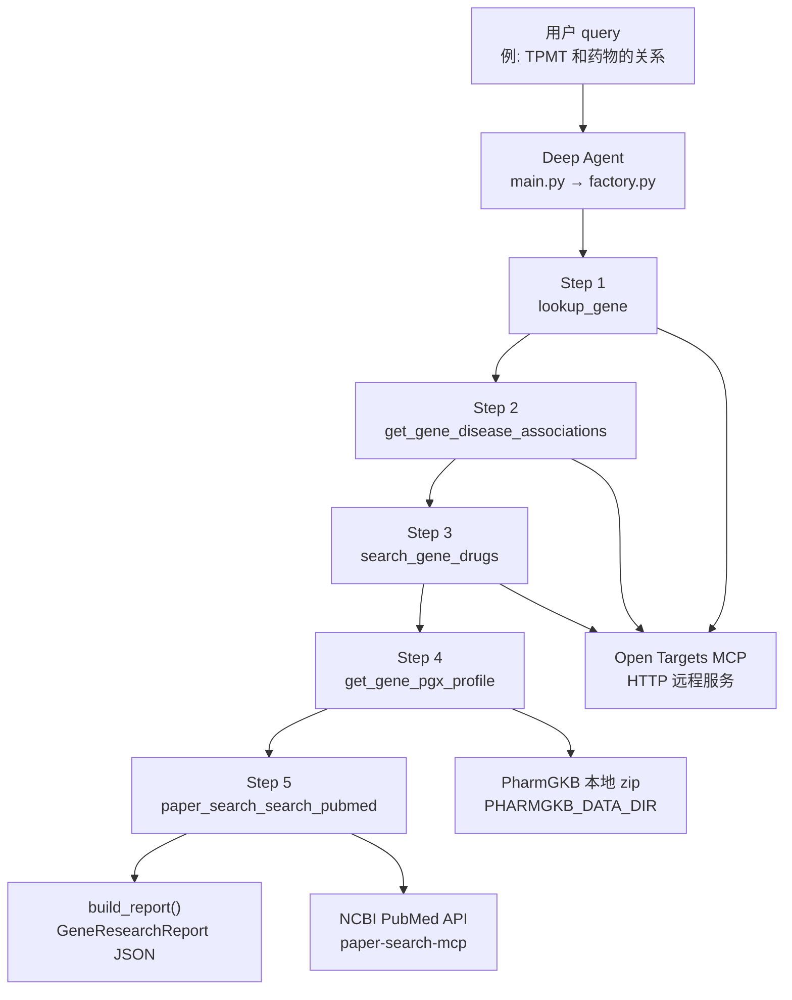

# 三数据源查询流程

本文档说明 `search-agent` 在回答基因相关问题时，如何依次调用 **Open Targets**、**ClinPGx 本地数据**、**文献搜索（PubMed）** 三个数据源，以及各步骤的输入、输出和依赖关系。

## 总览



每次基因查询 **必须跑完全部 5 步**，不区分「PGx 问题」还是「靶点问题」。某一步无数据时继续后续步骤，并在最终摘要中说明。

---

## 入口与编排

| 组件 | 路径 | 作用 |
|------|------|------|
| CLI 入口 | `main.py` | 接收 query，调用 agent，输出 text / JSON |
| Agent 构建 | `agent/factory.py` | 注册工具、加载 skills、定义 mandatory workflow |
| 报告聚合 | `agent/report.py` | 从 agent 的 ToolMessage 历史解析结构化 `GeneResearchReport` |
| 数据模型 | `agent/schemas.py` | `GeneInfo`、`DiseaseAssociation`、`DrugHit`、`PgxDrugProfile`、`PaperHit` |

Agent 根据 `skills/gene-research/SKILL.md` 和 system prompt 决定工具调用顺序；report 层只负责 **事后解析**，不参与调度。

---

## 数据源 1：Open Targets（步骤 1–3）

**类型**：远程 MCP 服务（HTTP）  
**配置**：`.env` 中 `OPEN_TARGETS_MCP_URL`（默认 `http://localhost:8010/mcp`）  
**代码**：`agent/open_targets_tools.py`  
**底层 MCP 工具**：`search_entities`、`query_open_targets_graphql`

### Step 1 — `lookup_gene(gene_symbol)`

| 项目 | 说明 |
|------|------|
| **输入** | 基因符号，如 `TPMT`、`BRCA2` |
| **查询目标** | Open Targets Platform 实体搜索 API |
| **MCP 调用** | `search_entities(query_strings=[gene_symbol])` |
| **输出** | `gene_symbol`、`ensembl_id`（如 `ENSG00000137364`）、`related_diseases`（搜索时附带的相关疾病） |
| **下游用途** | Step 2 使用 `ensembl_id` |

```json
{
  "gene_symbol": "TPMT",
  "ensembl_id": "ENSG00000137364",
  "related_diseases": [...]
}
```

### Step 2 — `get_gene_disease_associations(ensembl_id, limit=5)`

| 项目 | 说明 |
|------|------|
| **输入** | Step 1 得到的 `ensembl_id`（`ENSG...` 格式） |
| **查询目标** | Open Targets GraphQL — `target.associatedDiseases` |
| **MCP 调用** | `query_open_targets_graphql`（预置 GraphQL 模板） |
| **输出** | `approvedSymbol`、疾病列表（`disease.id`、`disease.name`、`score`） |
| **下游用途** | 报告 `diseases[]`；Step 5 构建 PubMed 查询词 |

```json
{
  "approvedSymbol": "TPMT",
  "associatedDiseases": {
    "count": 123,
    "rows": [
      { "disease": { "id": "MONDO_...", "name": "..." }, "score": 0.45 }
    ]
  }
}
```

### Step 3 — `search_gene_drugs(gene_symbol, drug_hint="")`

| 项目 | 说明 |
|------|------|
| **输入** | 基因符号；可选 `drug_hint` 缩小范围 |
| **查询目标** | Open Targets GraphQL — `search(entityNames: ["drug"])` |
| **MCP 调用** | `query_open_targets_graphql` |
| **输出** | 最多 10 条药物：`id`（ChEMBL ID）、`name`、`description` |
| **下游用途** | 报告 `drugs[]`；Step 5 构建 PubMed 查询词 |

```json
[
  {
    "id": "CHEMBL727",
    "name": "AZATHIOPRINE",
    "description": "Small molecule drug with a maximum clinical stage of Approval..."
  }
]
```

**Open Targets 在线页面**（report 中 `sources.url`）：

- 基因：`https://platform.opentargets.org/target/{ensembl_id}`
- 疾病：`https://platform.opentargets.org/disease/{disease_id}`
- 药物：`https://platform.opentargets.org/drug/{chembl_id}`

---

## 数据源 2：ClinPGx 本地 PharmGKB（步骤 4）

**类型**：本地文件（zip 压缩包，启动时解压读取）  
**配置**：`.env` 中 `PHARMGKB_DATA_DIR`（默认 `/mnt/workspace/lixinhang/data/pharmGKB`）  
**代码**：`tools/clinpgx.py` → `tools/clinpgx_local.py`

### 本地目录结构

```
PHARMGKB_DATA_DIR/
├── PrimaryData/
│   └── genes.zip                    → genes.tsv
└── AnnotationData/
    ├── summaryAnnotations.zip       → summary_annotations.tsv, summary_ann_alleles.tsv
    ├── guidelineAnnotations.json.zip → 各 guideline JSON
    └── pathways-tsv.zip             → 各代谢通路 TSV
```

| 文件 | 读取内容 |
|------|----------|
| `genes.tsv` | 基因符号 → PharmGKB Accession ID、VIP 标记、是否有 CPIC 指南 |
| `summary_annotations.tsv` | 基因-药物关联、证据等级、效应类型、ClinPGx URL |
| `summary_ann_alleles.tsv` | 等位基因/基因型 → 注释文本、等位基因功能 |
| `guidelineAnnotations.json.zip` | CPIC/DPWG 等指南摘要、相关药物 |
| `pathways-tsv.zip` | 基因参与的 PK/PD 代谢通路 |

### Step 4 — `get_gene_pgx_profile(gene_symbol)`

| 项目 | 说明 |
|------|------|
| **输入** | 基因符号，如 `TPMT` |
| **查询目标** | 上述本地 zip，**不访问网络** |
| **逻辑** | 按基因聚合指南 + 摘要注释 + 等位基因效应 + 通路，按优先级 P0/P1/P2 排序 |
| **默认过滤** | `include_low_evidence=false` 时只返回 P0/P1（有指南或 1A/1B 证据） |
| **输出** | `gene_meta`、`drugs[]`（每药含 guideline、evidence_levels、allele_effects 等） |
| **无数据时** | 返回 `{"error": "Gene 'XXX' not found in local ClinPGx genes.tsv."}` |

示例输出见 `test_data/clinpgx_TPMT_profile.json`。

**ClinPGx 在线链接**（report 中 `sources.url`）：

- 基因页：`https://www.clinpgx.org/gene/{accession_id}`（如 `PA356`）
- 临床注释：`https://www.clinpgx.org/clinicalAnnotation/...`

---

## 数据源 3：文献搜索 PubMed（步骤 5）

**类型**：远程 API，经 MCP 子进程调用  
**配置**：`paper-search-mcp` 通过 stdio 启动，无需 API Key（PubMed/arXiv）  
**代码**：MCP 包 `paper_search_mcp`；Agent 工具名带前缀 `paper_search_search_pubmed`

### Step 5 — `paper_search_search_pubmed(query, max_results=3)`

| 项目 | 说明 |
|------|------|
| **输入** | 查询字符串，通常由基因符号 + Step 2–4 的疾病/药物词组合，如 `"TPMT" AND (pharmacogenomics OR azathioprine)` |
| **查询目标** | NCBI E-utilities（`esearch` + `efetch`） |
| **返回内容** | **元数据 + 摘要**，不是全文 |
| **每条字段** | `paper_id`（PMID）、`title`、`authors`、`abstract`、`doi`、`published_date`、`url` |
| **PubMed 限制** | 不支持直接下载/读取 PDF 全文 |

```json
{
  "paper_id": "42240275",
  "title": "...",
  "authors": "Smith J; Doe A",
  "abstract": "IntroductionDrug metabolism is primarily...",
  "doi": "10.1177/...",
  "published_date": "2026-01-01T00:00:00",
  "url": "https://pubmed.ncbi.nlm.nih.gov/42240275/",
  "pdf_url": "",
  "source": "pubmed"
}
```

可选：`paper_search_search_arxiv` — 预印本/计算生物学方向，同样返回 abstract + metadata。

---

## 完整流程示例（TPMT）

以 `uv run python main.py "TPMT和药物的关系"` 为例：

```
用户 query
    │
    ▼
① lookup_gene("TPMT")
    │  Open Targets MCP → search_entities
    │  得到 ensembl_id = ENSG00000137364
    ▼
② get_gene_disease_associations("ENSG00000137364")
    │  Open Targets GraphQL → associatedDiseases
    │  得到 top 5 疾病及关联分数
    ▼
③ search_gene_drugs("TPMT")
    │  Open Targets GraphQL → drug search
    │  得到 AZATHIOPRINE、MERCAPTOPURINE 等 ChEMBL 药物
    ▼
④ get_gene_pgx_profile("TPMT")
    │  本地 PHARMGKB_DATA_DIR/*.zip
    │  得到 azathioprine / mercaptopurine / thioguanine / cisplatin 的 PGx 指南与等位基因效应
    ▼
⑤ paper_search_search_pubmed('"TPMT" AND (pharmacogenomics OR thiopurine)', max_results=3)
    │  NCBI PubMed API
    │  得到 3 篇文献的 title + abstract + DOI
    ▼
build_report() → GeneResearchReport JSON
    ├── gene          ← Step ①
    ├── diseases[]    ← Step ②
    ├── drugs[]       ← Step ③
    ├── pgx_drugs[]   ← Step ④
    ├── papers[]      ← Step ⑤
    ├── summary       ← Agent 最终文本回复
    └── sources[]     ← 各条数据的出处 URL
```

---

## 最终报告字段映射

| JSON 字段 | 来源步骤 | provider |
|-----------|----------|----------|
| `gene` | Step ① `lookup_gene` | `open_targets` |
| `diseases[]` | Step ② `get_gene_disease_associations` | `open_targets` |
| `drugs[]` | Step ③ `search_gene_drugs` | `open_targets` |
| `pgx_drugs[]` | Step ④ `get_gene_pgx_profile` | `clinpgx_local` |
| `papers[]` | Step ⑤ `paper_search_search_*` | `pubmed` / `arxiv` |
| `summary` | Agent LLM 综合回复 | — |
| `sources[]` | 上述所有 tool 调用的去重出处 | 混合 |

---

## 环境与前置依赖

| 依赖 | 检查方式 |
|------|----------|
| LLM | `.env` 中 `LLM_BASE_URL`、`LLM_API_KEY`、`LLM_MODEL` |
| Open Targets MCP | Docker 运行在 `8010` 端口，或修改 `OPEN_TARGETS_MCP_URL` |
| PharmGKB 本地数据 | `PHARMGKB_DATA_DIR` 下四个 zip 文件齐全 |
| 文献 MCP | `uv` 环境已安装 `paper-search-mcp`，首次调用自动 spawn 子进程 |

---

## 相关代码索引

| 文件 | 内容 |
|------|------|
| `agent/factory.py` | System prompt、工具注册、mandatory workflow |
| `agent/open_targets_tools.py` | Open Targets 三个 wrapper 工具 |
| `tools/clinpgx_local.py` | PharmGKB zip 加载与 PGx profile 构建 |
| `tools/clinpgx.py` | `get_gene_pgx_profile` LangChain tool（Agent 调用） |
| `agent/report.py` | ToolMessage → 结构化报告 |
| `skills/gene-research/SKILL.md` | Agent 侧 workflow 说明 |
| `skills/paper-search/SKILL.md` | 文献搜索策略与返回格式 |
| `tools/clinpgx_profile.py` | ClinPGx PGx profile CLI（`pgx-profile`） |
