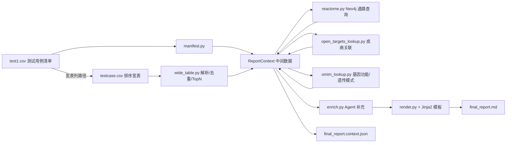

# Final Report 生成说明

本文档说明当前「基因组变异分析报告」的生成流程、数据来源，以及各章节内容由**脚本**、**Agent** 还是**静态模板**产生。

---

## 1. 总体流程



**入口命令：**

```bash
# 默认启用 Agent（推荐：输出目录模式）
uv run python scripts/generate_final_report.py \
  --output-dir test_data/output/25B06715455

# 指定 manifest 行与 Top N
uv run python scripts/generate_final_report.py \
  --manifest test_data/test_case/test1.csv \
  --row-index 0 \
  --top-n 5 \
  --output-dir test_data/output/25B06715455
```

**输出文件：**

使用 `--output-dir`（推荐，一次拿到全部产物）：

| 文件 | 说明 |
|------|------|
| `meta.json` | 中间数据：test1.csv 解析后的样本元信息 |
| `context.json` | 中间数据：完整 `ReportContext`（宽表解析 + Agent 叙事） |
| `context.pre_agent.json` | 中间数据：Agent 运行前的 `ReportContext`（脚本预取字段快照） |
| `report.md` | 最终 Markdown 报告 |

### 导出 HTML / PDF

生成 `report.md` 后，可用 [`scripts/export_report.py`](../scripts/export_report.py) 导出网页与 PDF：

| 格式 | 推荐方案 | 说明 |
|------|----------|------|
| **网页 HTML** | Pandoc → 独立 HTML + CSS | 带目录、表格、代码块；浏览器直接打开 |
| **PDF** | Pandoc + **Typst** | 表格分页、中文排版较稳（推荐） |
| **PDF 备选** | `md-to-pdf`（Chrome 渲染） | Typst 不可用时自动回退 |

**依赖安装：**

```bash
uv sync --extra export
# Typst CLI（PDF 推荐）：下载到 tools/bin/typst
# https://github.com/typst/typst/releases
```

**导出命令：**

```bash
# 同时导出 report.html + report.pdf（与 report.md 同目录）
uv run python scripts/export_report.py test_data/output/25B06715455_v1/report.md --all

# 仅 HTML（网页模式）
uv run python scripts/export_report.py test_data/output/25B06715455_v1/report.md --html

# 仅 PDF（Typst）
uv run python scripts/export_report.py test_data/output/25B06715455_v1/report.md --pdf --pdf-engine typst
```

样式文件：[`scripts/export/report.css`](../scripts/export/report.css)

或使用默认单文件模式（`--output`）：

| 文件 | 说明 |
|------|------|
| `<sample_id>_final_report.md` | 最终 Markdown 报告 |
| `<sample_id>.meta.json` | 样本元信息 |
| `<sample_id>.context.json` | 完整 `ReportContext` |
| `<sample_id>.context.pre_agent.json` | Agent 前快照 |

---

## 2. 输入数据来源

### 2.1 测试用例清单 `test1.csv`

由 [`report/manifest.py`](../report/manifest.py) 解析，映射为 `SampleMeta`。

| CSV 列 | 报告中的用途 |
|--------|-------------|
| 家系类型（首列） | §1 Header「家系类型」 |
| 家系关系 | §1 Header「家系关系」 |
| 样本编号 | §1 样本 ID；输出文件名 |
| 临床信息 | §1 临床诊断/指征；Agent 表型匹配输入 |
| raghpo | §1 HPO 表型；Agent 表型匹配输入 |
| raghpo-returns | 当前未写入报告（预留） |
| 37 to 38 | §1 / §4 liftover 路径 |
| gz to vcf | §1 / §4 VCF 来源路径 |
| **宽表** | 指向排序宽表 CSV 的路径（核心变异数据来源） |
| 基因与疾病 / ppi / 报告 | 当前未使用（预留） |

### 2.2 排序宽表 `testcase.csv`

由 [`report/wide_table.py`](../report/wide_table.py) 加载。该文件是 VEP 注释 + 致病性排序后的**变异宽表**，每行对应一个「变异 × 转录本」组合。

宽表字段含义详见 [`test_data/test_case/test_case.md`](../test_data/test_case/test_case.md)。

**脚本预处理逻辑：**

1. **变异去重**：按 `(chrom, pos, ref, alt)` 合并多转录本行
2. **转录本选择**（每个变异保留 1 行）：`vep_pick=1` > `tx_rank_within_variant=1` > `mane_select` 非空 > `pathogenic_rank` 最小
3. **基因聚合**：按 `gene_symbol` 分组，基因排序 = 组内最小 `pathogenic_rank`
4. **Top N 筛选**：默认取前 5 个基因（`--top-n` 可改）

当前测试样本 `25B06715455` 的 Top 5 基因为：`FMO3`, `KMT2C`, `BCAT2`, `LAMA2`, `NOTCH3`。

---

## 3. 报告章节与内容来源

报告结构对齐 [`test_data/test_case/example_temp.md`](../test_data/test_case/example_temp.md) v1.1，共 8 大节。

图例：

- 🟢 **脚本**：从 CSV 确定性抽取 + 规则计算
- 🔵 **Agent**：LLM + Open Targets 生成（默认启用）
- 🟡 **静态模板**：固定文案
- 🟠 **Fallback**：Agent 失败时的规则化占位/短句

| 章节 | 主要内容 | 来源 |
|------|----------|------|
| **§1 报告头部** | 样本 ID、家系、临床诊断、HPO、VCF/宽表路径、报告日期 | 🟢 test1.csv + 系统日期；受众/报告人为静态默认值 |
| **§2.1 Top 基因表** | 排名、基因名、变异数、致病性排名、ClinVar、**主要关联表型**、**主要关联通路** | 🟢 宽表 + **Open Targets MCP**（§4）+ **Reactome GraphDB**（§5） |
| **§2.2 关键发现** | 逐基因要点列表 | 🔵 Agent（`key_findings`）；🟠 Agent 失败时由 ClinVar + 后果 + HPO 规则生成 |
| **§2.3 排序得分展示** | `evidence_summary` 树状分解 | 🟢 宽表 `evidence_summary` 字符串解析 |
| **§3 基因卡片** | 见下表 | 混合 |
| **§4 方法学** | 分析流程图、QC 表、排序方法说明 | 🟡 静态模板 + 🟢 test1.csv 路径 + 🟢 宽表统计（变异数/基因数） |
| **§5 免责声明** | 6 条固定免责说明 | 🟡 静态模板 |
| **§6 阴性结果** | 未纳入 Top N 的基因数、总变异数等 | 🟢 宽表统计 |
| **§7 临床建议** | 立即建议、动态监测、沟通要点 | 🔵 Agent；🟠 Agent 失败时按 ClinVar 致病性分级生成短句 |
| **§8 ReportOutput** | JSON 元信息（版本、基因列表、输出路径等） | 🟢 脚本组装 |

### §3 基因卡片明细

每个 Top 基因生成一张卡片，模板位于 [`report/templates/sections/gene_card_script.md.j2`](../report/templates/sections/gene_card_script.md.j2)。

| 子节 | 内容 | 来源 |
|------|------|------|
| **3.x.1 基因概述** — 基因名、坐标、转录本、致病性排名、**主要关联表型/通路** | 宽表字段 + 外部查询 | 🟢 |
| **3.x.1 基因概述** — 基因功能、遗传模式 | OMIM SQLite + Agent 其他叙事 | 🟢 OMIM（§6）；🔵 Agent（表型关联/文献等） |
| **3.x.2 变异列表** | 坐标、HGVS、后果、CADD、SpliceAI、gnomAD、ClinVar、VAF | 🟢 宽表（经格式化，如 VAF 转百分比） |
| **3.x.3.1 测序质量** | VAF、DP、外显子 | 🟢 `vcf_info_AF`、`vcf_info_DP`、`exon` |
| **3.x.3.2 转录本与功能** | 转录本、RefSeq、HGVSc/HGVSp、VEP 后果/影响 | 🟢 宽表 |
| **3.x.3.3 预测工具** | CADD、SpliceAI、REVEL、LOFTEE 及解读短句 | 🟢 宽表 + 🟢 阈值规则（如 CADD > 20） |
| **3.x.3.4 人群频率与数据库** | gnomAD、ClinVar 详情、GTEx 表达 | 🟢 宽表 |
| **3.x.3.5 蛋白结构域** | `protein_domains`、`evidence_summary` | 🟢 宽表 |
| **3.x.3.6 文献证据** | PMID、标题、摘要、证据等级 | 🔵 Agent；🟠 Agent 失败时显示「待 Agent 补充」 |
| **3.x.4 表型-通路关联** | 关联表型、通路、临床建议 | 🔵 Agent；🟠 Agent 失败时回退脚本预取字段或占位文案 |

### 宽表 → 报告字段映射（常用）

| 宽表列 | 报告用途 |
|--------|----------|
| `chrom`, `pos`, `ref`, `alt` | 基因组坐标 |
| `gene_symbol` | 基因名、分组依据 |
| `transcript_id`, `mane_select`, `refseq_id` | 转录本 |
| `hgvsc`, `hgvsp`, `consequence`, `impact`, `exon` | 变异注释 |
| `cadd_phred`, `revel_score`, `spliceAI_ds_max`, `loftee_lof_flag` | 预测工具评分 |
| `gnomAD_eas_AF`, `gnomAD_popmax_AF`, `gnomAD_nhomalt` | 人群频率 |
| `clinvar_significance`, `clinvar_review_status`, `clinvar_star_rating` | ClinVar 证据 |
| `vcf_info_AF`, `vcf_info_DP` | VAF、测序深度 |
| `clinical_best_tissue`, `clinical_transcript_tpm`, `gtex_transcript_top5_tissues` | 组织表达 |
| `protein_domains`, `evidence_summary` | 结构域、排序证据 |
| `pathogenic_rank` | 致病性排名、Top 基因筛选 |

---

## 4. Open Targets 疾病关联查询

§2.1「主要关联表型」列由 **Open Targets MCP** 确定性查询得到，实现在 [`report/open_targets_lookup.py`](../report/open_targets_lookup.py) 与 [`report/phenotypes.py`](../report/phenotypes.py)。

### 4.1 环境变量

| 变量 | 默认值 | 说明 |
|------|--------|------|
| `OPEN_TARGETS_ENABLED` | `1` | 设为 `0` 可关闭表型查询，该列显示 `-` |
| `OPEN_TARGETS_MCP_URL` | — | Open Targets MCP 服务地址（见 [`.env.example`](../.env.example)） |

### 4.2 查询逻辑

对每个 Top 基因：

1. 调用 `lookup_gene`（MCP `search_entities`）解析 Ensembl ID
2. 调用 `get_gene_disease_associations` 获取关联疾病列表（按 Open Targets score 排序）
3. 取 score 最高的 1–2 个疾病名称，以 `; ` 拼接写入 `main_associated_phenotype`
4. 查不到则填 `-`

结果写入 `ReportContext` 的 `main_associated_phenotype` 字段（`TopGeneSummary` / `GeneCard`），并出现在 `context.json` 中。

### 4.3 与 Agent 表型叙事的区别

| 字段 | 来源 | 位置 |
|------|------|------|
| `main_associated_phenotype` | Open Targets 脚本侧查询 | §2.1 Top 基因表、§3.x.1 概述 |
| `narrative.phenotype_association` | Agent 生成（可选） | §3.x.4 基因卡片 |

Agent 失败时，§3.x.4「关联表型」会回退显示脚本预取的 `main_associated_phenotype`。

---

## 5. Reactome GraphDB 通路查询

§2.1「主要关联通路」列由本地 **Reactome GraphDB（Neo4j）** 查询得到，实现在 [`report/reactome.py`](../report/reactome.py) 与 [`report/pathways.py`](../report/pathways.py)。

### 5.1 环境变量

在 `.env` 中配置（参见 [`.env.example`](../.env.example)）：

| 变量 | 默认值 | 说明 |
|------|--------|------|
| `REACTOME_ENABLED` | `1` | 设为 `0` 可关闭通路查询，该列显示 `-` |
| `REACTOME_NEO4J_URI` | `bolt://localhost:7687` | Neo4j Bolt 地址 |
| `REACTOME_NEO4J_USER` | `neo4j` | 用户名 |
| `REACTOME_NEO4J_PASSWORD` | `neo4j` | 密码 |
| `REACTOME_NEO4J_DATABASE` | `graph.db` | 数据库名（Reactome 镜像通常为 `graph.db`，不是 `neo4j`） |

Docker 示例（与当前环境一致）：

```text
public.ecr.aws/reactome/graphdb:latest
端口: 7474 (HTTP), 7687 (Bolt)
```

### 5.2 查询逻辑

对每个 Top 基因执行 Cypher：从 `ReferenceEntity.geneName` 匹配基因，沿 `ReactionLikeEvent` → `Pathway` 关系查找关联通路，再按规则选出**一条**主要通路：

1. 优先选通路名**包含基因 symbol** 的（如 NOTCH3 → `Signaling by NOTCH3`）
2. 否则排除过于泛化的通路名（如 `Signal Transduction`），取较具体的一条
3. 查不到则填 `-`

结果写入 `ReportContext` 的 `main_pathway` 字段（`TopGeneSummary` / `GeneCard`），并出现在 `context.json` 中。

### 5.3 与 Agent 通路叙事的区别

| 字段 | 来源 | 位置 |
|------|------|------|
| `main_pathway` | Reactome Neo4j 确定性查询 | §2.1 Top 基因表 |
| `narrative.pathway_summary` | Agent 生成（可选） | §3.x.4 基因卡片 |

---

## 6. OMIM 基因功能 / 遗传模式查询

§3.x.1「基因功能」「遗传模式」由本地 **OMIM SQLite** 确定性查询，实现在 [`report/omim_lookup.py`](../report/omim_lookup.py) 与 [`report/omim_enrich.py`](../report/omim_enrich.py)。Agent 侧工具为 [`agent/omim_tools.py`](../agent/omim_tools.py) 的 `lookup_omim_gene`。

### 6.1 环境变量

| 变量 | 默认值 | 说明 |
|------|--------|------|
| `OMIM_ENABLED` | `1` | 设为 `0` 可关闭 OMIM 查询 |
| `OMIM_DB_PATH` | `./data/omim/omim_20250411.sqlite3` | OMIM SQLite 文件路径 |

### 6.2 查询逻辑

对每个 Top 基因，按 `hgnc_gene_symbol` 精确匹配 `omim` 表中 `mim_type='gene'` 的记录：

| 报告字段 | OMIM 表字段 | 规则 |
|----------|-------------|------|
| **基因功能** | `geneFunction` | 非空则采用；否则回退 `description`；超长截断 |
| **遗传模式** | `geneMap` / `phenotypeMap` | 解析 JSON 数组中每条 `Inheritance`（AD/AR/…）与表型名，格式如 `CADASIL (Autosomal dominant)` |

写入 `GeneCard.omim_gene_function` / `omim_inheritance_mode`，并优先填入 `GeneNarrative.gene_function` / `inheritance_mode`。

### 6.3 工具字段映射（`lookup_omim_gene`）

| 工具入参 | 工具返回字段 | OMIM 来源 |
|----------|--------------|-----------|
| `gene_symbol` | `gene_function` | `geneFunction` → `description` |
| `gene_symbol` | `inheritance_mode` | `geneMap[].Inheritance` + `Phenotype View` |
| `gene_symbol` | `mim_number`, `title`, `linked_phenotypes` | 元数据 / 结构化表型列表 |

---

## 7. Agent 补充说明（默认启用）

由 [`report/enrich.py`](../report/enrich.py) 调用 [`agent/factory.py`](../agent/factory.py) 中的 **Deep Agent**（带工具），向 `ReportContext` 回填叙事字段。

### 7.1 Agent 与工具（非纯 LLM）

| Agent | 构建函数 | 绑定工具 |
|-------|----------|----------|
| 基因叙事 Agent | `build_report_gene_agent()` | `lookup_omim_gene`、`lookup_gene`、`get_gene_disease_associations`、默认 `paper_search_search_pubmed` |
| 临床建议 Agent | `build_report_clinical_agent()` | 同上 |

Agent **自行决定何时调工具**。宽表变异数据、`omim_gene_function`、`omim_inheritance_mode`、`reactome_main_pathway`、`open_targets_main_phenotype` 等作为 user message 传入；**基因功能/遗传模式以 OMIM 为准**，LLM 不得篡改这些数值。

报告 Agent **默认加载** PubMed 工具（与 `OPEN_TARGETS_ONLY` 无关）；主基因检索 Agent 仍受 `OPEN_TARGETS_ONLY` 控制（为 `1` 时不加载 ClinPGx / 文献）。

### 7.2 每个 Top 基因一次 Agent 调用

输入（JSON user message）示例字段：

- `clinical_info`、`hpo_terms`（来自 test1.csv）
- `gene_symbol`、`variants`（来自宽表）
- `omim_gene_function`、`omim_inheritance_mode`（来自 OMIM SQLite，§6）
- `reactome_main_pathway`（来自 Reactome Neo4j，§5）
- `open_targets_main_phenotype`（来自 Open Targets，§4）

Agent 工作流（system prompt 约束）：

1. 将 OMIM 预取的 `gene_function` / `inheritance_mode` 原样写入 JSON
2. 调用 `get_gene_disease_associations` 补充表型关联
3. 调用 PubMed 检索基因 + 表型相关文献
4. 输出 JSON：`gene_function`、`inheritance_mode`、`phenotype_association`、`pathway_summary`、`clinical_note`、`literature[]`

### 7.3 全报告一次临床建议 Agent 调用

输入：全部 Top 基因（含 `reactome_main_pathway`、`open_targets_main_phenotype`、变异摘要）+ 临床信息 + HPO。

Agent 对关键基因调用 Open Targets 了解疾病背景后，输出：

- `immediate_recommendations` → §7.1
- `monitoring` → §7.2
- `communication_points` → §7.3
- `key_findings` → §2.2

### 7.4 依赖

| 依赖 | 用途 |
|------|------|
| `.env` 中 `LLM_*` | Agent 推理与 JSON 生成 |
| OMIM SQLite（§6） | §3.x.1 基因功能 / 遗传模式（脚本侧 + `lookup_omim_gene` 工具） |
| Open Targets MCP（§4） | §2.1 表型列（脚本侧）；Agent 工具复用同一 MCP |
| Reactome Neo4j（§5） | §2.1 通路列（脚本侧，非 Agent 工具） |
| `OPEN_TARGETS_ONLY=0` | 主 Agent 额外启用 ClinPGx + 文献（报告 Agent 的 PubMed 不受此开关影响） |
| LLM / MCP 不可用时 | Agent 调用失败则对应章节回退为占位或规则 Fallback，报告仍可输出 |

---

## 8. 渲染层（Jinja2 模板）

脚本不负责拼接字符串，而是由 [`report/render.py`](../report/render.py) 加载模板渲染：

```
report/templates/
├── final_report.md.j2              # 主框架
└── sections/
    ├── header.md.j2
    ├── executive_summary.md.j2
    ├── gene_card_script.md.j2
    ├── methodology.md.j2
    └── disclaimer.md.j2
```

`.md.j2` = Markdown 输出格式 + Jinja2 模板语法（`{{ 变量 }}`、`` 等）。

渲染时注入 `ReportContext`（`ctx`），并注册格式化函数：`format_vaf`、`format_af` 等。

---

## 9. 代码模块职责

| 模块 | 职责 |
|------|------|
| [`scripts/generate_final_report.py`](../scripts/generate_final_report.py) | CLI 入口 |
| [`report/pipeline.py`](../report/pipeline.py) | 串联 manifest → wide_table → 外部注释 → enrich → 输出 |
| [`report/manifest.py`](../report/manifest.py) | 解析 test1.csv |
| [`report/wide_table.py`](../report/wide_table.py) | 宽表加载、去重、Top N |
| [`report/models.py`](../report/models.py) | Pydantic 数据模型 |
| [`report/omim_lookup.py`](../report/omim_lookup.py) | OMIM SQLite 基因功能 / 遗传模式查询 |
| [`report/omim_enrich.py`](../report/omim_enrich.py) | 为 Top 基因附加 OMIM 字段 |
| [`agent/omim_tools.py`](../agent/omim_tools.py) | Agent 工具 `lookup_omim_gene` |
| [`report/open_targets_lookup.py`](../report/open_targets_lookup.py) | Open Targets 疾病关联查询 |
| [`report/phenotypes.py`](../report/phenotypes.py) | 为 Top 基因附加 `main_associated_phenotype` |
| [`report/reactome.py`](../report/reactome.py) | Reactome Neo4j 通路查询 |
| [`report/pathways.py`](../report/pathways.py) | 为 Top 基因附加 `main_pathway` |
| [`report/enrich.py`](../report/enrich.py) | Agent 叙事补充 |
| [`report/render.py`](../report/render.py) | Jinja2 渲染 + fallback 逻辑 |
| [`report/merge.py`](../report/merge.py) | 写 MD + JSON 快照 |

---

## 10. 当前默认行为小结

运行 `uv run python scripts/generate_final_report.py` 时（**默认启用 Agent**）：

- **宽表/清单数据**：所有变异表格、评分、频率、排名、样本信息
- **Open Targets 表型**：§2.1「主要关联表型」列（MCP 可达时自动填充；不可达时为 `-`）
- **Reactome 通路**：§2.1「主要关联通路」列（Neo4j 可达时自动填充；不可达时为 `-`）
- **OMIM 基因概述**：§3.x.1「基因功能」「遗传模式」（本地 SQLite 确定性填充）
- **Agent 叙事**：表型关联、文献、§2.2 关键发现、§7 临床建议
- **规则 Fallback**：Agent 失败时，§2.2 / §7 / §3 占位字段回退为模板化短句
- **静态文案**：§4 流程说明、§5 免责声明、部分 Header 默认值

变异数值始终以宽表为准；Agent 只补充解读叙事，不修改排序结果。

### 与 `example_temp.md` v1.1 对齐情况

| 模板项 | 状态 | 说明 |
|--------|------|------|
| §2.1 主要关联表型 | ✅ | Open Targets 脚本查询 |
| §2.1 主要关联通路 | ✅ | Reactome Neo4j |
| §3.x.1 基因功能 / 遗传模式 | ✅ | OMIM SQLite 脚本查询 |
| §2.1 排序得分列 | ➖ | 本框架用 `pathogenic_rank` 名次替代 GPA 得分 |
| §3.x.3.6 文献 | 🔵 | 默认 Agent + PubMed 工具 |

| 肿瘤专用字段（GT/TLOD、PARP、ctDNA） | ➖ | 罕见病 WES 用例不适用 |

---

## 11. 与 T/SZGIA 4-2018 skill 的关系

[`skills/genetic-testing-report/`](../skills/genetic-testing-report/) 是另一套「临床单基因遗传病检测报告」规范（T/SZGIA 4-2018），结构与当前 `example_temp.md` 格式**不同**。本 Final Report 框架独立实现，未直接复用该 skill 的模板。
