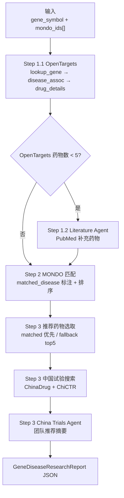

# Gene + MONDO 结构化 Workflow

本文档说明 **结构化 workflow 模式** 的整体流程、各步骤逻辑，以及最终 JSON 报告中每个字段的含义与示例。

> 旧版「自然语言 query + 单 Agent 驱动」流程见 [`DATA_FLOW.md`](DATA_FLOW.md)。两种模式可并存。

---

## 1. 总览

结构化 workflow 将基因靶点研究拆成 **3 个确定性阶段 + 2 个可选 Agent 阶段**，输入固定为基因符号 + MONDO 疾病 ID 列表，输出 `GeneDiseaseResearchReport` JSON。



### 入口

| 组件 | 路径 | 作用 |
|------|------|------|
| CLI | `main.py` | `--gene` + `--mondo-ids` 触发 workflow |
| 编排 | `agent/workflow.py` | `run_workflow()` 逐步执行 |
| 报告 | `agent/report.py` | `build_workflow_report()` 组装 JSON |
| 数据模型 | `agent/schemas.py` | `GeneDiseaseResearchInput`、`GeneDiseaseResearchReport` 等 |
| MONDO 匹配 | `tools/mondo.py` | 本地 `mondo-rare.json` 索引与跨本体 ID 扩展 |

### 运行示例

```bash
uv run python main.py --gene CFTR --mondo-ids MONDO_0009061 --format json -o report.json
```

---

## 2. 输入 Schema

模型：`GeneDiseaseResearchInput`（`agent/schemas.py`）

| 字段 | 类型 | 说明 |
|------|------|------|
| `gene_symbol` | `str` | HGNC 基因符号，如 `CFTR`、`TPMT` |
| `mondo_ids` | `list[str]` | 目标 MONDO 疾病 ID，如 `MONDO_0009061`；可为空 |

**示例：**

```json
{
  "gene_symbol": "CFTR",
  "mondo_ids": ["MONDO_0009061"]
}
```

---

## 3. 各步骤详解

### Step 1.1 — OpenTargets 确定性查询

**类型**：纯工具调用（无 LLM 编排）  
**代码**：`agent/workflow.py` → `_step_open_targets()`  
**工具**：`agent/open_targets_tools.py`

| 顺序 | 工具 | 输入 | 产出字段 |
|------|------|------|----------|
| 1 | `lookup_gene` | `gene_symbol` | `gene` |
| 2 | `get_gene_disease_associations` | `ensembl_id`, `limit=5` | `diseases[]` |
| 3 | `get_gene_drug_details` | `gene_symbol`, `limit=10` | `drugs[]`（OpenTargets 来源） |

#### 3.1 `gene` — 基因基本信息

```json
{
  "symbol": "CFTR",
  "ensembl_id": "ENSG00000001626",
  "source": {
    "provider": "open_targets",
    "tool": "lookup_gene",
    "url": "https://platform.opentargets.org/target/ENSG00000001626",
    "entity_id": "ENSG00000001626"
  }
}
```

| 字段 | 说明 |
|------|------|
| `symbol` | 基因符号 |
| `ensembl_id` | Ensembl 基因 ID |
| `source` | 数据来源追溯（provider / tool / url / entity_id） |

#### 3.2 `diseases[]` — 基因-疾病关联（Open Targets Top 5）

```json
{
  "id": "MONDO_0009061",
  "name": "cystic fibrosis",
  "score": 0.9133535862571094,
  "source": {
    "provider": "open_targets",
    "tool": "get_gene_disease_associations",
    "url": "https://platform.opentargets.org/disease/MONDO_0009061",
    "entity_id": "MONDO_0009061"
  }
}
```

| 字段 | 说明 |
|------|------|
| `id` | 疾病本体 ID（常见 `MONDO_*`、`EFO_*`） |
| `name` | 疾病名称 |
| `score` | Open Targets 关联得分（0–1，越高越相关） |

#### 3.3 `drugs[]`（Step 1.1 初始）— 药物完整 Profile

每条记录为 `FilteredDrugHit`，Step 1.1 结束时 `matched_disease` 均为 `false`，Step 2 后才标注。

```json
{
  "chembl_id": "CHEMBL2010601",
  "name": "IVACAFTOR",
  "description": "Small molecule drug with a maximum clinical stage of Approval ...",
  "maximum_clinical_stage": "APPROVAL",
  "indications": [
    {
      "disease_id": "MONDO_0009061",
      "disease_name": "cystic fibrosis",
      "max_clinical_stage": "APPROVAL"
    }
  ],
  "mechanisms": [
    {
      "mechanism": "Cystic fibrosis transmembrane conductance regulator positive modulator",
      "target_name": "Cystic fibrosis transmembrane conductance regulator",
      "target_genes": ["CFTR"]
    }
  ],
  "adverse_events": [
    {
      "name": "infective pulmonary exacerbation of cystic fibrosis",
      "count": 1049,
      "log_lr": 5667.74,
      "meddra_code": "10070608"
    }
  ],
  "pharmacogenomics": [
    {
      "gene_symbol": "CFTR",
      "variant_rs_id": "rs113993960",
      "phenotype": "increased response",
      "category": "efficacy",
      "evidence_level": "1A",
      "annotation": "Patients with cystic fibrosis and the rs113993960 del/del genotype ...",
      "literature_pmids": ["24973281"]
    }
  ],
  "references": [
    {
      "pmid": "24973281",
      "title": "A CFTR corrector (lumacaftor) and a CFTR potentiator (ivacaftor) ...",
      "doi": "10.1016/S2213-2600(14)70132-8",
      "url": "https://pubmed.ncbi.nlm.nih.gov/24973281/"
    }
  ],
  "source": {
    "provider": "open_targets",
    "tool": "get_gene_drug_details",
    "url": "https://platform.opentargets.org/drug/CHEMBL2010601",
    "entity_id": "CHEMBL2010601"
  },
  "matched_disease": false,
  "matched_mondo_ids": []
}
```

**药物子字段说明：**

| 字段 | 说明 |
|------|------|
| `chembl_id` | ChEMBL 药物 ID |
| `name` | 药物名称 |
| `description` | Open Targets 药物描述 |
| `maximum_clinical_stage` | 最高临床阶段：`APPROVAL` > `PHASE_3` > `PHASE_2` > ... |
| `indications[]` | 适应症列表；`disease_id` 可能为 `MONDO_*`、`EFO_*`、`HP_*` |
| `mechanisms[]` | 作用机制与靶基因 |
| `adverse_events[]` | 不良事件统计（MedDRA） |
| `pharmacogenomics[]` | 药物基因组学注释 |
| `references[]` | PubMed 参考文献（含 DOI） |

**Step 1.1 元数据**（写入最终 `workflow_meta.step_1_1`）：

```json
{
  "duration_s": 31.07,
  "ot_drug_count": 10
}
```

---

### Step 1.2 — Literature Agent（条件触发）

**触发条件**：Step 1.1 有效药物数 **< 5**

**跳过条件**（写入 `workflow_meta.step_1_2`）：

| 原因 | 说明 |
|------|------|
| `ot_drug_count >= 5` | OpenTargets 已有足够药物 |
| `OPEN_TARGETS_ONLY=1` | 默认配置未启用 PubMed MCP |
| Agent 异常 | 网络 / LLM 调用失败 |

**Agent**：`build_literature_agent()`（`agent/factory.py`）  
**工具**：`paper_search_search_pubmed`  
**产出字段**：`literature_drugs[]`、`papers[]`

#### `literature_drugs[]` — 文献补充药物

结构与 `drugs[]` 相同（`FilteredDrugHit`），但通常只有部分字段有值：

```json
{
  "chembl_id": "",
  "name": "DRUG_NAME_FROM_LITERATURE",
  "description": "Evidence summary from PubMed abstract ...",
  "maximum_clinical_stage": null,
  "indications": [],
  "mechanisms": [],
  "adverse_events": [],
  "pharmacogenomics": [],
  "references": [],
  "source": {
    "provider": "paper_search",
    "tool": "paper_search_search_pubmed",
    "url": null,
    "entity_id": "DRUG_NAME_FROM_LITERATURE"
  },
  "matched_disease": false,
  "matched_mondo_ids": []
}
```

> 文献药物与 OpenTargets 药物按 **名称去重** 合并到 `drugs[]`；OpenTargets 结果优先。

#### `papers[]` — PubMed 检索结果

```json
{
  "paper_id": "12345678",
  "title": "Paper title ...",
  "authors": "Author A, Author B",
  "abstract": "Abstract text ...",
  "published_date": "2024-01-15",
  "url": "https://pubmed.ncbi.nlm.nih.gov/12345678/",
  "doi": "10.1234/example",
  "pdf_url": null,
  "source": {
    "provider": "pubmed",
    "tool": "paper_search_search_pubmed",
    "url": "https://pubmed.ncbi.nlm.nih.gov/12345678/",
    "entity_id": "12345678"
  }
}
```

**Step 1.2 元数据示例（已跳过）：**

```json
{
  "skipped": true,
  "reason": "ot_drug_count >= 5"
}
```

**Step 1.2 元数据示例（已执行）：**

```json
{
  "skipped": false,
  "duration_s": 12.5,
  "literature_drug_count": 2,
  "paper_count": 5
}
```

---

### Step 2 — MONDO 疾病匹配与排序

**类型**：纯 Python（`tools/mondo.py` + `agent/workflow.py`）  
**输入**：合并后的 `drugs[]` + 用户 `mondo_ids[]`

#### 匹配逻辑

1. 对每个输入 MONDO ID，通过本地 `mondo-rare.json` 扩展等价 ID（含 `DOID_*`、`EFO_*` 等 xref）
2. 遍历每个药物的 `indications[].disease_id`
3. 若 indication ID 落在任一扩展集合中 → `matched_disease = true`，并记录命中的 `matched_mondo_ids`
4. 否则 → `matched_disease = false`

**匹配后示例（IVACAFTOR + MONDO_0009061）：**

```json
{
  "chembl_id": "CHEMBL2010601",
  "name": "IVACAFTOR",
  "matched_disease": true,
  "matched_mondo_ids": ["MONDO_0009061"]
}
```

**未匹配示例（CROFELEMER）：**

```json
{
  "chembl_id": "CHEMBL2108184",
  "name": "CROFELEMER",
  "matched_disease": false,
  "matched_mondo_ids": []
}
```

#### 排序规则

1. `matched_disease = true` 的排在前面
2. 组内按 `maximum_clinical_stage` 降序（`APPROVAL` 优先）

**Step 2 元数据：**

```json
{
  "duration_s": 2.0,
  "matched_count": 8,
  "total_count": 10
}
```

---

### Step 3 — 中国临床试验团队推荐

**分两步**：确定性工具搜索 + LLM Agent 摘要

#### 3.1 推荐药物选取

| 优先级 | 规则 |
|--------|------|
| 1 | 取全部 `matched_disease = true` 的药物 |
| 2（fallback） | 若无匹配，按临床阶段取 top 5 |

#### 3.2 确定性试验搜索

对每个推荐药物调用：

| 工具 | 数据源 | 搜索字段 |
|------|--------|----------|
| `search_chinadrug_trials` | `data/ChinaDrug/chinadrugtrials.csv` | 药名、适应症、标题 |
| `search_chictr_trials` | `data/Chictr/chictr.csv` | 干预措施、研究疾病、标题 |

**产出字段**：`team_recommendations[]`

```json
{
  "drug_name": "IVACAFTOR",
  "chembl_id": "CHEMBL2010601",
  "matched_disease": true,
  "chinadrug_trials": [
    {
      "source": "ChinaDrug",
      "registration_number": "CTR20240001",
      "drug_name": "Ivacaftor",
      "title": "Trial title ...",
      "team": {
        "applicant": "申办方",
        "main_leader": "主要研究者",
        "company": "申办单位",
        "committee": "伦理委员会"
      },
      "match_score": 13
    }
  ],
  "chictr_trials": [
    {
      "source": "ChiCTR",
      "registration_number": "ChiCTR2500104474",
      "drug_name": "Ivacaftor",
      "title": "Public title ...",
      "team": {
        "applicant": "申请人",
        "study_leader": "研究负责人",
        "applicant_institution": "申请单位",
        "primary_sponsor": "Primary sponsor"
      },
      "match_score": 10
    }
  ],
  "agent_summary": "LLM 对中国试验团队的整体推荐摘要（仅第一条记录携带）"
}
```

| 字段 | 说明 |
|------|------|
| `drug_name` | 推荐药物名称 |
| `chembl_id` | ChEMBL ID（文献来源药物可能为空） |
| `matched_disease` | 是否匹配目标 MONDO 疾病 |
| `chinadrug_trials[]` | ChinaDrug 注册试验匹配结果 |
| `chictr_trials[]` | ChiCTR 注册试验匹配结果 |
| `agent_summary` | China Trials Agent 生成的 Markdown 摘要；通常只在第一个推荐药物上填充 |

**ChinaTrialHit.team 字段对照：**

| 来源 | team 字段 |
|------|-----------|
| ChinaDrug | `applicant`, `main_leader`, `company`, `committee` |
| ChiCTR | `applicant`, `study_leader`, `applicant_institution`, `primary_sponsor` |

#### 3.3 China Trials Agent

**Agent**：`build_china_trials_agent()`（`agent/factory.py`）  
**作用**：在工具搜索结果基础上，生成 sponsor / PI / institution 的综合推荐文本，写入 `summary` 和首条 `agent_summary`。

**Step 3 元数据：**

```json
{
  "duration_s": 75.87,
  "recommended_drug_count": 8,
  "trial_search_count": 8
}
```

---

## 4. 最终报告 Schema

模型：`GeneDiseaseResearchReport`（`agent/schemas.py`）

### 顶层字段

| 字段 | 类型 | 产出步骤 | 说明 |
|------|------|----------|------|
| `input` | `GeneDiseaseResearchInput` | — | 原始输入 |
| `query` | `str` | 组装 | 自动生成的描述字符串 |
| `generated_at` | `str` | 组装 | ISO 8601 UTC 时间戳 |
| `summary` | `str` | 组装 | Markdown 格式人类可读摘要 |
| `gene` | `GeneInfo` | Step 1.1 | 基因信息 |
| `diseases` | `list[DiseaseAssociation]` | Step 1.1 | 基因-疾病关联 Top 5 |
| `drugs` | `list[FilteredDrugHit]` | Step 1.1 + 1.2 + 2 | 全部药物（含匹配标注） |
| `literature_drugs` | `list[FilteredDrugHit]` | Step 1.2 | 仅文献补充来源的药物 |
| `team_recommendations` | `list[DrugTeamRecommendation]` | Step 3 | 中国试验团队推荐 |
| `papers` | `list[PaperHit]` | Step 1.2 | PubMed 文献（若触发） |
| `sources` | `list[DataSource]` | 全程 | 去重后的数据来源列表 |
| `workflow_meta` | `dict` | 全程 | 各步骤耗时与分支决策 |

### 完整顶层示例（精简）

```json
{
  "input": {
    "gene_symbol": "CFTR",
    "mondo_ids": ["MONDO_0009061"]
  },
  "query": "Gene CFTR research for MONDO diseases: MONDO_0009061",
  "generated_at": "2026-06-12T07:17:18.345167+00:00",
  "summary": "## Gene: CFTR\n## Target MONDO IDs: MONDO_0009061\n...",
  "gene": { "...": "..." },
  "diseases": [{ "...": "..." }],
  "drugs": [{ "...": "..." }],
  "literature_drugs": [],
  "team_recommendations": [{ "...": "..." }],
  "papers": [],
  "sources": [{ "...": "..." }],
  "workflow_meta": {
    "step_1_1": { "duration_s": 31.07, "ot_drug_count": 10 },
    "step_1_2": { "skipped": true, "reason": "ot_drug_count >= 5" },
    "step_2": { "duration_s": 2.0, "matched_count": 8, "total_count": 10 },
    "step_3": { "duration_s": 75.87, "recommended_drug_count": 8, "trial_search_count": 8 }
  }
}
```

完整真实输出可参考：[`test_data/output/report.json`](../test_data/output/report.json)

---

## 5. 数据流与字段产生时机

```
输入 gene_symbol + mondo_ids
    │
    ├─ Step 1.1 ──► gene, diseases[], drugs[] (OT)
    │
    ├─ Step 1.2 ──► literature_drugs[], papers[]  (条件)
    │               └─ 合并 ──► drugs[]
    │
    ├─ Step 2 ────► drugs[].matched_disease
    │               drugs[].matched_mondo_ids
    │               drugs[] 排序
    │
    └─ Step 3 ────► team_recommendations[]
                    summary (含 agent 摘要)
                    workflow_meta
```

---

## 6. 与旧模式对比

| 维度 | 结构化 Workflow | 旧 Free-text 模式 |
|------|-----------------|-------------------|
| 入口 | `--gene CFTR --mondo-ids MONDO_0009061` | `"CFTR 与囊性纤维化的靶点关联"` |
| 编排 | `agent/workflow.py` 代码驱动 | Agent prompt 驱动 |
| 输出模型 | `GeneDiseaseResearchReport` | `GeneResearchReport` |
| 疾病匹配 | `matched_disease` + MONDO 索引 | 无 |
| 中国试验 | `team_recommendations[]` 结构化 | 仅在 text summary 中 |
| ClinPGx / 全量 PubMed | 不在 workflow 中 | `OPEN_TARGETS_ONLY=0` 时启用 |

---

## 7. 配置依赖

| 配置 / 数据 | 影响步骤 | 说明 |
|-------------|----------|------|
| `OPEN_TARGETS_MCP_URL` | Step 1.1 | Open Targets MCP 服务地址 |
| `OPEN_TARGETS_ONLY=1` | Step 1.2 | 默认跳过 PubMed 补充 |
| `LLM_MODEL` / `LLM_API_KEY` | Step 1.2、3 | Agent 摘要生成 |
| `data/MONDO/mondo-rare.json` | Step 2 | MONDO 跨本体匹配 |
| `data/ChinaDrug/chinadrugtrials.csv` | Step 3 | ChinaDrug 本地检索 |
| `data/Chictr/chictr.csv` | Step 3 | ChiCTR 本地检索 |

---

## 8. 相关文件索引

| 路径 | 说明 |
|------|------|
| `main.py` | CLI 入口，`--gene` / `--mondo-ids` |
| `agent/workflow.py` | Workflow 主流程 |
| `agent/schemas.py` | Pydantic 数据模型 |
| `agent/report.py` | 报告组装与 payload 解析 |
| `agent/factory.py` | Literature / China Trials 专用 Agent |
| `agent/open_targets_tools.py` | Open Targets 工具封装 |
| `tools/mondo.py` | MONDO 索引与疾病匹配 |
| `tools/china_trials.py` | 中国试验 registry 工具 |
| `test_data/output/report.json` | CFTR 完整输出示例 |
| `test_data/cftr.json` | 旧模式 Open Targets 输出参考 |
