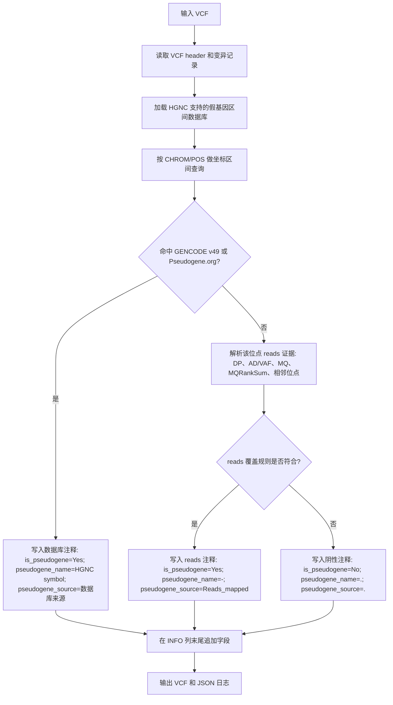

# Pseudogene Annotation Module

工作目录：`/mnt/workspace/xiongliwen/04.Pseudogene_anno`

## 实现状态

当前版本已实现 VCF 输入/输出，并新增 reads 覆盖层面的补充判断。`annotate_pseudogene.py` 会先执行 HGNC 支持的假基因数据库坐标区间注释；只有数据库未命中的 VCF 位点才进入 reads 覆盖层面判断。`api_app.py` 已同步为 VCF 输出文件名。

## 功能

对输入 VCF 的每一条变异记录进行假基因相关注释，并在输出 VCF 的 INFO 列最后追加 3 个字段：

- `is_pseudogene`: `Yes` / `No`
- `pseudogene_name`: 可映射到 HGNC 的假基因 symbol；多基因用 `;` 分隔；如果仅由 reads 覆盖层面判断为假基因相关，则为 `-`
- `pseudogene_source`: `GENCODE.v49`、`Pseudogene.org` 或 `Pseudogene.org&GENCODE.v49`；如果仅由 reads 覆盖层面判断为假基因相关，则为 `Reads_mapped`

## 输入与输出

#### 输入：VCF

输入 VCF 至少需要包含标准 VCF 前 8 列：

- `#CHROM`
- `POS`
- `ID`
- `REF`
- `ALT`
- `QUAL`
- `FILTER`
- `INFO`

reads 覆盖层面判断需要从 VCF INFO 和/或 FORMAT 样本列中解析深度、等位基因深度、VAF、MQ 等信息。不同 caller 的字段名可能不同，脚本实现时需要提供可配置字段映射或兼容常见字段。

#### 输出：VCF

输出仍为 VCF，保留原始 header 与所有原始记录顺序。每条记录在 INFO 列最后追加：

```text
is_pseudogene=Yes|No;pseudogene_name=<symbol-list|-|empty>;pseudogene_source=<source|Reads_mapped|empty>
```

追加规则：

- 如果原 INFO 为 `.`，输出 INFO 只包含新增字段。
- 如果原 INFO 非空，新增字段追加在 INFO 字符串末尾。
- 如果输入 INFO 中已存在同名字段，建议实现时先移除旧值再追加新值，避免重复键。
- VCF header 中应补充对应 `##INFO=<ID=...>` 定义。

## 判定逻辑

模块包含两条证据路径：

1. 坐标区间证据：判断位点是否落入 HGNC 支持的假基因区间。
2. reads 覆盖证据：判断该位点的变异信号是否可能来自假基因/同源序列 reads 的错误比对。

执行顺序必须是先做假基因数据库坐标区间注释，再对数据库未注释到的 VCF 位点做 reads 覆盖层面查询。已经被 GENCODE v49 或 Pseudogene.org 命中的位点不再进入 reads 覆盖判断，避免 reads 证据覆盖或改变数据库来源注释。

最终合并规则：

| 坐标区间证据 | reads 覆盖证据 | `is_pseudogene` | `pseudogene_name` | `pseudogene_source` |
|---|---|---|---|---|
| 命中 | 不查询 | `Yes` | HGNC symbol；多基因用 `;` | `GENCODE.v49` / `Pseudogene.org` / `Pseudogene.org&GENCODE.v49` |
| 未命中 | 符合 | `Yes` | `-` | `Reads_mapped` |
| 未命中 | 不符合 | `No` | `.` | `.` |

说明：reads 覆盖证据只作为数据库未命中位点的补充注释路径使用。若位点已经命中 HGNC 支持的假基因区间，直接保留坐标区间证据对应的 HGNC symbol 和数据库来源，不再计算 reads 覆盖规则。

## 流程图



## 坐标区间证据

本模块按 1-based inclusive 坐标判断位点是否落入假基因区间。

染色体/contig 匹配策略：

- 标准染色体支持 `chr` 前缀和无 `chr` 前缀互通，例如 `chr14` 与 `14`。
- 非标准 contig 只做 exact/前缀别名匹配，例如 `chr14_GL000009v2_random` 可尝试匹配 `chr14_GL000009v2_random` 和 `14_GL000009v2_random`。
- 非标准 contig 不会被投射或退化到主染色体，例如 `chr14_GL000009v2_random` 不会当作 `chr14` 查询。
- 如果输入 chrom/contig 在数据库中匹配不到，不报错，该位点输出为未命中坐标区间证据，并在 JSON 日志中记录 `unmatched_chrom_rows` 和示例 contig。

### 数据来源

默认读取：

- GENCODE v49:
  `/mnt/workspace/xiongliwen/00.PublicData/Pseudogene/GENCODE/release_49/gencode.v49.2wayconspseudos.gtf.gz`
- Pseudogene.org Human90:
  `/mnt/workspace/xiongliwen/00.PublicData/Pseudogene/Pseudogene.org/Human90/Human90.txt`
- HGNC:
  `/mnt/workspace/xiongliwen/00.PublicData/phenotype_hpo_v1/hgnc_complete_set.txt`

过滤规则：

1. 从 HGNC 中筛选 `locus_group` 或 `locus_type` 含 `pseudogene` 的记录。
2. 用 HGNC 的 `pseudogene.org` 字段建立 `PGOHUM ID -> HGNC symbol` 映射。
3. GENCODE 和 Pseudogene.org 中不能映射到 HGNC pseudogene symbol 的区间不参与最终坐标区间注释。

## reads 覆盖证据

reads 覆盖层面的目标是识别：该位点上的变异信号是否可能来自假基因、同源序列、多拷贝区域或其他相似区域 reads 的错误比对，从而形成伪突变。

如果某个位点的总深度异常升高，但 VAF 很低，且 ALT reads 多表现为低 MQ，说明该 ALT 可能并非真实突变位点，而是相似区域 reads 错误比对到目标位点。

建议保留的组合证据：

| 采用项 | 组合证据 | 是否建议保留 | 理由 |
|---:|---|---|---|
| 1 | DP 升高 + VAF 偏低/偏离 50% + MQ 偏低 | 建议保留 | 典型“同源 reads 汇入目标位点”模式，适合作为假基因数据库注释后的 reads-level 支持证据。 |
| 2 | DP 升高 + 多个相邻位点异常 + VAF 比例相近 | 建议保留 | 单个位点异常可能偶然；多个邻近位点以相近 VAF 成片出现，更符合假基因/同源拷贝按固定比例混入。 |
| 3 | ALT reads 的 MQ 明显低于 REF reads + VAF 异常 | 建议保留 | 区分“真实突变”和“错配 reads 伪突变”的关键证据。ALT reads 系统性低 MQ，说明 ALT 来源不唯一或来自相似区域。 |

实现时建议将 reads 层面判断写成可配置阈值，而不是固定在代码中。推荐阈值项包括：

- 高深度阈值：如 `DP >= min_high_dp`
- 低 VAF 阈值：如 `VAF <= max_low_vaf`
- 偏离杂合 50% 阈值：如 `abs(VAF - 0.5) >= min_vaf_deviation_from_het`
- 低 MQ 阈值：如 `MQ <= max_low_mq`
- ALT/REF reads MQ 差异阈值：如 `REF_MQ - ALT_MQ >= min_ref_alt_mq_delta`
- 相邻窗口大小：如 `neighbor_window_bp`
- 相邻异常位点个数：如 `min_neighbor_abnormal_variants`
- 相邻位点 VAF 相似度：如 `max_neighbor_vaf_delta`

## 测试数据运行命令

当前 VCF 版本命令示例：

```bash
cd /mnt/workspace/xiongliwen/04.Pseudogene_anno
python3 annotate_pseudogene.py \
  --input input.vcf \
  --output output.pseudogene_annotated.vcf \
  --log-json output.pseudogene_annotation.log.json
```

运行结束会在 stdout 打印 JSON 日志，建议包含：

- 输入 VCF 记录总数
- 坐标区间证据注释为假基因的记录数
- reads 覆盖证据补充注释为假基因的记录数
- 总注释为假基因的记录数
- 未注释为假基因的记录数
- 注释到的 HGNC 假基因 symbol 种类数
- 按来源统计的记录数
- 数据库中未匹配到 contig 的记录数和示例
- 非标准 contig 的记录数、注释数、未注释数和示例
- reads 层面各判定项命中的记录数

## 当前 VCF 测试结果

测试输入：

`/mnt/workspace/xiongliwen/04.Pseudogene_anno/P001.genotyper10000.vcf`

测试输出：

`/mnt/workspace/xiongliwen/04.Pseudogene_anno/P001.genotyper10000.pseudogene_annotated.vcf`

日志：

`/mnt/workspace/xiongliwen/04.Pseudogene_anno/P001.genotyper10000.pseudogene_annotation.log.json`

统计：

| 指标 | 数量 |
|---|---:|
| 输入 VCF records | 10,000 |
| 数据库坐标区间注释为假基因 | 11 |
| reads 覆盖补充注释为假基因 | 129 |
| 总注释为假基因 | 140 |
| 未注释为假基因 | 9,860 |
| 数据库未命中后进入 reads 判断 | 9,989 |
| 注释到的 HGNC 假基因 symbol 种类 | 6 |
| 来源为 Pseudogene.org | 8 |
| 来源为 Pseudogene.org&GENCODE.v49 | 3 |
| 来源为 GENCODE.v49 | 0 |
| 来源为 Reads_mapped | 129 |

reads 规则命中统计：

| 规则 | 数量 |
|---|---:|
| `alt_mq_lower_than_ref_vaf_abnormal` | 90 |
| `high_dp_neighbor_abnormal_similar_vaf` | 36 |
| `high_dp_vaf_abnormal_low_mq` | 23 |

VCF 格式校验：

| 检查项 | 结果 |
|---|---|
| 输入列数 | 10 |
| 输出列数 | 10 |
| 输出 records | 10,000 |
| 列数异常 records | 0 |
| 新增 INFO header | 3 |

默认 reads 阈值：

| 参数 | 默认值 |
|---|---:|
| `min_high_dp` | 50 |
| `max_low_vaf` | 0.2 |
| `min_vaf_deviation_from_het` | 0.3 |
| `max_low_mq` | 40.0 |
| `min_ref_alt_mq_delta` | 3.0 |
| `neighbor_window_bp` | 200 |
| `min_neighbor_abnormal_variants` | 3 |
| `max_neighbor_vaf_delta` | 0.1 |

## 历史测试结果

以下为 CSV 版本历史测试结果，保留用于对照。

测试输入：

`/mnt/workspace/pangjiangshuan/vep_runner/output/all_900_genes_mutations1_pass_weak_germline.vep.csv`

测试输出：

`/mnt/workspace/xiongliwen/04.Pseudogene_anno/all_900_genes_mutations1_pass_weak_germline.pseudogene_annotated.csv`

日志：

`/mnt/workspace/xiongliwen/04.Pseudogene_anno/all_900_genes_mutations1_pass_weak_germline.pseudogene_annotated.log.json`

统计：

| 指标 | 数量 |
|---|---:|
| 输入数据行 | 32,479 |
| 注释为假基因 | 23 |
| 未注释为假基因 | 32,456 |
| 注释到的 HGNC 假基因 symbol 种类 | 12 |
| 来源为 Pseudogene.org | 22 |
| 来源为 Pseudogene.org&GENCODE.v49 | 1 |
| 来源为 GENCODE.v49 | 0 |

## FastAPI 封装

更新日期：2026-06-12

API 封装文件：

- `api_app.py`
- `start_api_7003.sh`

服务端口：`7003`

状态约定：

| status | 含义 |
|---|---|
| `queuing` | 任务已提交或正在运行 |
| `completion` | 任务完成，可以下载结果 |
| `failure` | 任务失败，查看 `message` 和 `log_tail` |

启动服务：

```bash
cd /mnt/workspace/xiongliwen/04.Pseudogene_anno
bash start_api_7003.sh
```

等价命令：

```bash
cd /mnt/workspace/xiongliwen/04.Pseudogene_anno
/mnt/workspace/xiongliwen/miniconda3/bin/conda run --no-capture-output -n hpo \
  uvicorn api_app:app --host 0.0.0.0 --port 7003
```

健康检查：

```bash
curl -s http://172.27.206.113:7003/health
```

### 提交任务

目标 API 调用方式一：提交服务器已有 VCF 文件路径。

```bash
curl -s -X POST http://172.27.206.113:7003/runs \
  -F input_path=/path/to/input.vcf
```

目标 API 调用方式二：上传本地 VCF 文件。

```bash
curl -s -X POST http://172.27.206.113:7003/runs \
  -F file=@/path/to/input.vcf
```

兼容 phenotype-HPO API 风格的 multipart 调用也可以保留；其中 `hpo_file`、`hpo_list`、`hgvs` 可被 API 接收并记录，但伪基因注释只使用 `file` 或 `input_path` 中的 VCF 位点和 reads 证据信息。

提交后返回示例：

```json
{
  "uid": "xxxxxxxxxxxxxxxxxxxxxxxxxxxxxxxx",
  "status": "queuing",
  "phase": "queued",
  "message": "Job queued",
  "status_url": "/runs/xxxxxxxxxxxxxxxxxxxxxxxxxxxxxxxx",
  "files_url": "/runs/xxxxxxxxxxxxxxxxxxxxxxxxxxxxxxxx/files"
}
```

### 查询与下载

查询状态：

```bash
curl -s http://172.27.206.113:7003/runs/{uid}
```

查看结果文件：

```bash
curl -s http://172.27.206.113:7003/runs/{uid}/files
```

完成任务对外提供 3 个下载文件：

| 文件 | 说明 |
|---|---|
| `README_pseudogene_anno_module.md` | 模块 README |
| `pseudogene_annotated.vcf` | INFO 增加 3 个字段后的注释结果 |
| `pseudogene_annotation.log.json` | 结构化运行日志和统计 |

下载示例：

```bash
curl -O http://172.27.206.113:7003/runs/{uid}/files/pseudogene_annotated.vcf
curl -O http://172.27.206.113:7003/runs/{uid}/files/pseudogene_annotation.log.json
curl -O http://172.27.206.113:7003/runs/{uid}/files/README_pseudogene_anno_module.md
```

API 运行目录：

`/mnt/workspace/xiongliwen/04.Pseudogene_anno/api_runs/{uid}`

每个任务会保存输入文件副本、状态 JSON、运行日志和输出文件；原始输入文件不会被修改。
